## Installing Appium
In order to perform mobile automation, <a href="https://nodejs.org/en/download/" class="external-link" target="_nexial_link">NodeJs</a> 
and <a href="https://github.com/appium/appium-desktop/releases/latest" class="external-link" target="_nexial_link">Appium</a> 
must be installed locally. Follow these links to download these open-source software and install them on your system.

Nexial will make a number of attempts to resolve the installation directory of both NodeJs and Appium. It does so via
searching through commonly known/used path locations. If you have installed NodeJs or Appium in custom locations, please 
set the following environment variables on your system:

```
NODE_BINARY_PATH=<location of node.exe or node executable>
APPIUM_BINARY_PATH=<installation location of Appium/Appium Desktop + /resources/app/node_modules/appium/build/lib/main.js>
```


## Android Setup
- **Batch File**: `$NEXIAL_HOME\bin\mobile\android-setup.cmd` (Windows) or `$NEXIAL_HOME/bin/mobile/android-setup.sh` (MacOS)
- **Purpose**: installing Android SDK, system images and emulators in predefined directory structure in order to expedite
  mobile test automation with Nexial.
- **Usage**:<br/>
  1. Open command console or terminal.
  2. Navigate to the `bin/mobile` directory under `$NEXIAL_HOME`
	3. Run `android-setup.cmd` (Windows) or `./android-setup.sh` by specifying your target project:
	
     | System  | Example                                         |
	   |+-------+|+------------------------------------------------|
		 | Windows | `android-setup.cmd -v -t C:\projects\MyProject` |
     | MacOS   | `./android-setup.sh -v -t ~/projects/MyProject` |
     |+-------+|+------------------------------------------------|


### Example
Executing this batch file without any option would render a basic help screen indicating the missing parameters:<br/>
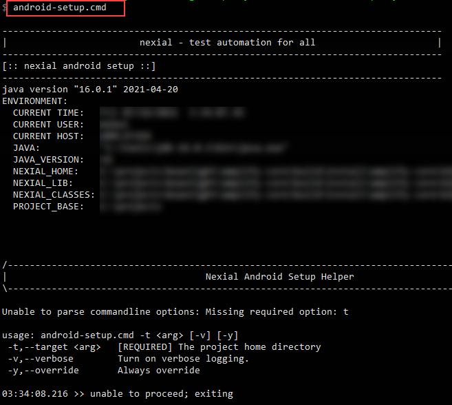

To install Android SDK, system images and emulators, add `-t <PROJECT_HOME>` and optionally `-v` for log verbosity,
like this:<br/>
```
android-setup.cmd -v -t C:\projects\MyProject
```

Below shows the various stages of the installation process.

#### Stage 1 - Confirming installation override
The `android-setup` batch file will install Android SDK and all related files under `<HOME>/.nexial/android/sdk`, the 
Android emulators will be installed under `<HOME>/.android/avd`.

If you had previously installed Android SDK, you will be asked to confirm if you want to override existing installation.
<br/>
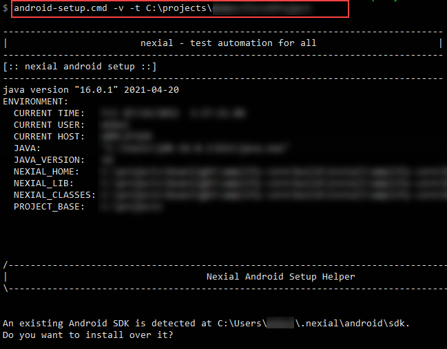

#### Stage 2 - Installing Android SDK CommandLine Tool
The `android-setup` batch file will download the commandline tool from the Internet and install it locally.<br/>
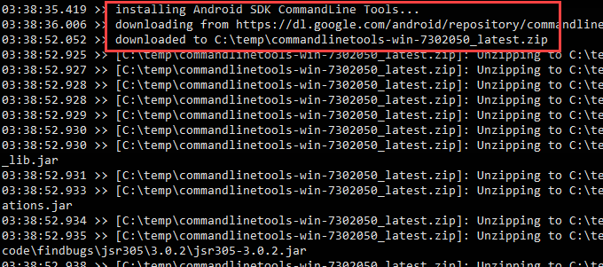

#### Stage 3 - Installing pre-accepted license agreements
As part of Android SDK installation, you will be asked to accept a series of license agreements. In order to expedite
the installation process and to support "silent installation", the `android-setup` batch file will "pre-accept" these
license agreements on your behalf.<br/>
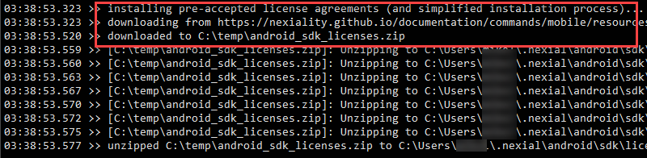

#### Stage 4 - Installing pre-packaged Android emulator skins
Nexial is prepackaged with a set of "skins" for a more realistic look and feel on the Android emulators. From time to
time, we will update these "skins" with additional ones.<br/>
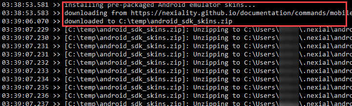

#### Stage 5 - Installing required Android SDK components
Next, the required Android SDK components are downloaded and installed locally.<br/>
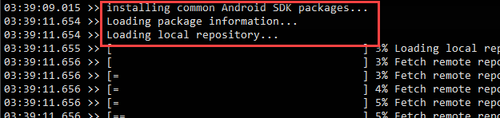

#### Stage 6 - Installing Android SDK system images
In order to run an Android emulator, at least 1 system image must be installed locally. Copy the name of one of the
listed system images...<br/>
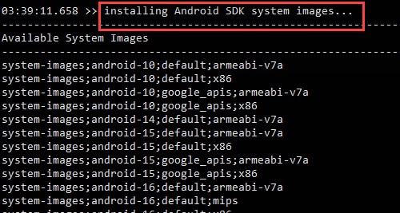

... paste it to the end of the prompt, and press `<ENTER>`:<br/>
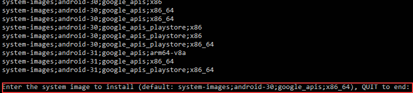

Repeat this process for as many system images you wish to install. Enter `QUIT` to end this stage.

#### Stage 7 - Setting up apksigner
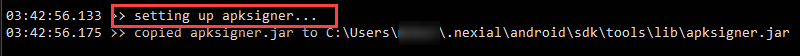

#### Stage 8 - Installing Android emulator
Copy one of the listed emulator IDs... <br/>
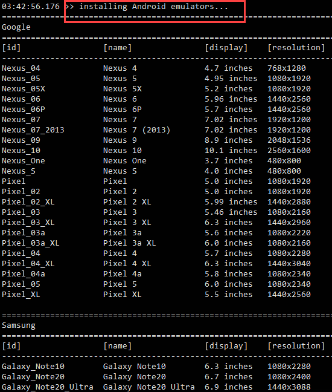

... paste it to the end of the prompt, and press `<ENTER>`. Then, specify one of the installed system images for this 
emulator:<br/>
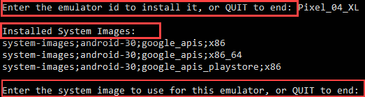

Repeat this stage to install more emulators. When done, enter `QUIT` to end this stage.<br/>
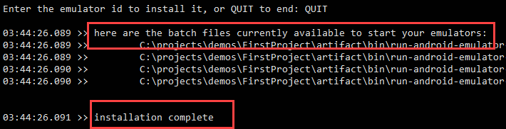


### Setting environment variables
By default, Nexial assumes that Android SDK is installed under `<HOME>/.nexial/android/sdk`. If you have installed the 
Android SDK in a different location, please set up the following environment variables:

```
ANDROID_HOME=<the location of Android SDK>
ANDROID_SDK_ROOT=<the location of Android SDK>
```

