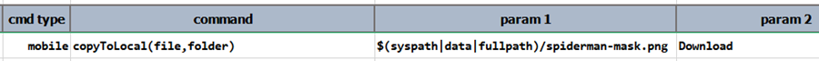

### Description
This command instructs Nexial to copy a `file` to a specific local `folder` in the currently connected device. Note that 
"local" here refers to what's _local_ to the mobile device (and not your computer). The `file` parameter refers to the 
fully qualified path of a file on the host where Nexial runs (such as your laptop or Jenkins agent), while the `folder`
parameter refers to a directory on the connected device.

For iOS device, the `folder` parameter is currently ignored. Only media files (with extension `.jpg`, `.png`, `.gif`, 
`.wbem`, `.mp4`) are supported and the target folder will always be Photos (where photos are stored on a iOS device).

Nexial uses the `bin/mobile/copy-to-ios` and `bin/mobile/copy-to-android` utility scripts internally to perform the 
file copy operations. This means that one could perform the same file copy operations by manually executing these 
utility scripts. Make sure that the target device is connected before executing the scripts.

For more information about these utility scripts, check out 
[Copy files to device](mobile_device_profile#copy-files-to-device).

### Parameters
- **file** - a fully qualified path of a file on the host machine
- **folder** - the target folder on the connected device to receive the specified `file`. Note that this parameter is
  ignore for iOS.

### Example

### See Also
- [`copy-to-ios`](mobile_device_profile#copy-files-to-device)
- [`copy-to-android`](mobile_device_profile#copy-files-to-device)
