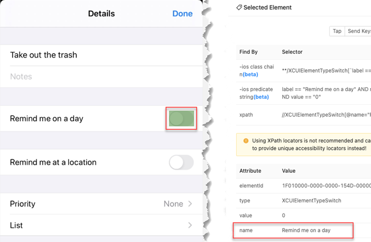
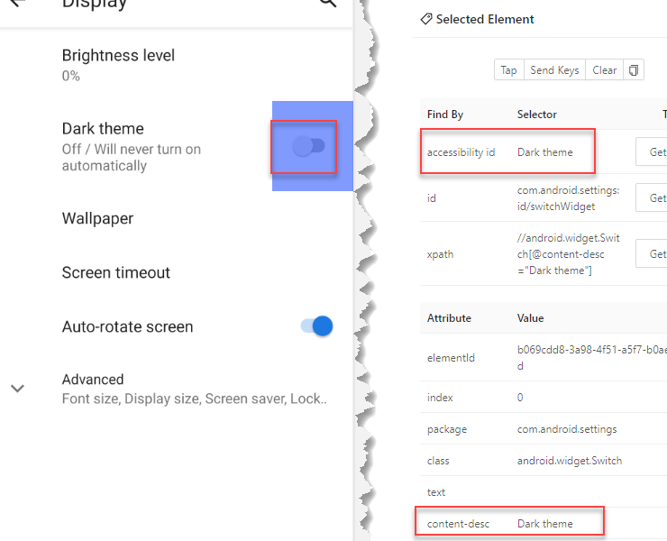

### Description
As the name suggests, this is a collection of commands to support mobile automation, with mobile testing as the common 
form. Generally speaking, there are 3 strategies towards mobile testing:
- via emulators
- via real devices connected to the automation host
- via cloud testing provider (such as BrowserStack or CrossBrowserTesting)

Nexial intends to support all 3 types of mobile testing for both iOS and Android devices. However, the availability on 
these capabilities will be rolled out over time.

Nexial internally uses <a href="https://appium.io/" class="external-link" target="_nexial_link">Appium</a> to perform
the communication and data transport between your scripts and the target devices. Unless of urgent or critical matter 
(such as a high priority security patch), Nexial will only ship with the last official stable release of Appium.

In order to perform mobile automation, here are the steps to follow:
1. [Install and Configure Appium](install_appium)
2. [Install Android SDK and Emulators](android_setup) - if you are targeting Android devices
3. [Install XCode and iOS Emulators] - if you are targeting iOS devices **_COMING SOON!_**
4. [Configure Mobile Device Profile](mobile_device_profile)
5. [Scripting with Emulator](script_with_emulator)
6. [Run your Mobile Automation on BrowserStack] - if you are planning to run your test via BrowserStack **_COMING SOON!_**

Click on each of the links above to get started.


### Locators
Those who are familiar with [web Automation](../web) knows that there are multiple types of 
[locators](../web/index#locators) (also known as selectors) to identify Web elements and to interact with them. For 
mobile automation, the use of locator is equally critical. However, there are some differences between these two types 
of automation. For one, not all the locators are available in mobile automation due to the underlying implementation 
mismatch (CSS, for example). Mobile automation also brings about a few new/unique locators as well.

For more details about using Appium Desktop to inspect elements and find locator, please visit Appium documentation on 
<a href="http://appium.io/docs/en/writing-running-appium/finding-elements/" class="external-link" target="_nexial_link">
Finding and interacting with elements</a>.

#### ID (`id=...`)
Reference an element by its ID is, by far, the simplest type of locator. Unfortunately, just like its web counterpart,
the "ID" in reference isn't always unique as one would hope. For simpler application this locator usually works well.
For more complex applications where an "ID" might be repeated across multiple elements, a different locator strategy 
(such as XPATH) might be a better way to go.

For Android application, the "resource-id" property is also considered as an "ID". One can use either the `id=...` or 
`res=...` syntax. Here's an example of finding a "ID" of a element via the Appium inspector:<br/>


For the above example, one may express this locator as:
- `id=com.google.android.calculator:id/digit_5`
- `res=com.google.android.calculator:id/digit_5`

In contrast, iOS automation uses the "name" property as the "ID". Note that there isn't an actual property named as 
"ID" or "id". However, one may use either `id=...` or `name=...` syntax. Nexial will appropriately resolve it to the 
correct type of locator.<br/>


For the above example, one may express this locator as:
- `id:Remind me on a day`
- `name=Remind me on a day`

#### Accessibility ID (`a11y=...`)
The design purpose of an accessibility ID is to improve usability for users with visual or hearing impairment. 
Accessibility tools like screen readers or TTS software utilize these IDs to provide additional usability support. From 
the test automation standpoint, the same accessibility ID can be utilized as the basis of identifying an element. As a
convenience, Nexial recognizes a locator by accessibility ID via the `a11y` prefix (there are 11 characters between 
`a` and `y` of `accessibility`).

On Android, this locator strategy uses `contentDescription` or `content-desc` property:<br/>


For the above example, the locator would be `a11y=Dark theme`.

On iOS, the accessibility id, the id, and the name locator strategies are all identical. Behind the scene, they are 
implemented the same way.<br/>


For the above example, one would specify this locator as `a11y=Back`.

Generally speaking, it is preferred to use the accessibility ID over ID (although on iOS they are the same) because the 
accessibility ID is 
1. beneficial to both testers and users with visual or hearing impairment.
2. generally more readable than plain ID.

#### XPATH (`xpath=...`)
The tried and true XPATH locator is available for mobile automation, as in the case of web or desktop automation. And
as it is in the case of other automation uses, XPATH is both powerful and potentially troublesome. 

With XPATH, one can search for an element via its hierarchy, its attributes and its text. Whereas the power lies, so 
is the danger thereof - ala 
<a href="https://en.wikipedia.org/wiki/With_great_power_comes_great_responsibility" class="external-link" target="_nexial_link">
Peter Parker principle </a>

It is often prudent **NOT** to use the XPATH locator provided by Appium inspector. Instead, one should put some effort 
to simplifying it. For example,<br/>


The provided/suggested XPATH for the "Connected devices" link is as follows (broken into lines for readability):
```
/hierarchy/android.widget.FrameLayout
 /android.widget.LinearLayout
  /android.widget.FrameLayout
   /android.view.ViewGroup
    /android.widget.ScrollView
     /android.widget.LinearLayout
      /android.widget.FrameLayout[2]
       /android.widget.LinearLayout
        /android.widget.FrameLayout
         /androidx.recyclerview.widget.RecyclerView
          /android.widget.LinearLayout[2]
           /android.widget.RelativeLayout
            /android.widget.TextView[1]
```

Surely this would work (since Appium provides this). It is also incredibly difficult to decipher and to maintain. 
Instead, one could reduce this to something like:
- `//android.widget.TextView[@text='Connected devices']`
- `//*[@text='Connected devices']`
 
The benefits of optimizing the XPATH are:
1. Easier to read, hence easier to maintain
2. No long dependent on the hierarchy or placements of UI elements
3. Potentially faster than the long-winded version

To use XPATH locator in Nexial, simply use the XPATH as is or prefix it with `xpath=`.

#### Name (`name=...`)
**Only applicable for iOS automation**. Alias to the ID locator. See [ID locator](#id-id) for more details.

#### Resource ID (`res=...`)
**Only applicable for Android automation**. Alias to the ID locator. See [ID locator](#id-id) for more details.

#### Predicate (`predicate=...`)
**Only applicable for Android automation**. Also known as `-ios predicate string`. This type of locator represents a 
recursive element search using the iOS Predicate (iOS 10.0 and above). The syntax is similar to XPATH query but comes 
with its own set of logical and comparative operators. While this type of locator is powerful, one would essentially be
writing another "mini" query language. Consult the following links for more details:
- http://appium.io/docs/en/writing-running-appium/ios/ios-predicate/
- https://github.com/appium/appium/blob/master/docs/en/writing-running-appium/ios/ios-predicate.md
- https://developer.apple.com/documentation/foundation/nspredicate

Since this only works on iOS and has dependency on the underlying iOS object model, this form of identifying elements
should not be considered as the first choice. Nonetheless, at times the iOS-specific technique might be the only viable 
option.

For this type of locator, prefix it with `predicate=`.

#### Class Chain (`cc=...`)
**Only applicable for Android automation**.

#### Link Text
This form of locator is not available in mobile automation. However, one can use the 
[`clickByDislayText(text)`](clickByDisplayText(text)) to achieve the same effect. Note that this command supports 
PolyMatcher, a flexible way to qualify the click target via its text. See the command for more details.  

#### Partial Link Text
This form of locator is not available in mobile automation. However, one can use the
[`clickByDislayText(text)`](clickByDisplayText(text)) to achieve the same effect. Note that this command supports
PolyMatcher, a flexible way to qualify the click target via its text. See the command for more details.

#### Tag
Not available in mobile automation.

#### Style Class
Not available in mobile automation.

#### CSS
Not available in mobile automation.

-----

The "mobile" command type represents a series of automation commands regarding mobile automation:

### Available Commands
- [`assertElementPresent(locator)`](assertElementPresent(locator))
- [`assertElementVisible(locator)`](assertElementVisible(locator))
- [`assertElementsPresent(prefix)`](assertElementsPresent(prefix))
- [`assertLocked()`](assertLocked())
- [`assertTextPresent(locator,text)`](assertTextPresent(locator,text))
- [`back()`](back())
- [`click(locator)`](click(locator))
- [`clickByDisplayText(text)`](clickByDisplayText(text))
- [`clickUntilNotFound(locator,waitMs,max)`](clickUntilNotFound(locator,waitMs,max))
- [`closeApp()`](closeApp())
- [`doubleClick(locator,xOffset,yOffset)`](doubleClick(locator,xOffset,yOffset))
- [`forward()`](forward())
- [`hideKeyboard()`](hideKeyboard())
- [`home()`](home())
- [`lock()`](lock())
- [`longClick(locator,waitMs)`](longClick(locator,waitMs))
- [`orientation(mode)`](orientation(mode))
- [`recentApps`](recentApps())
- [`saveCount(var,locator)`](saveCount(var,locator))
- [`saveLockStatus(var)`](saveLockStatus(var))
- [`saveText(var,locator)`](saveText(var,locator))
- [`saveTextArray(var,locator)`](saveTextArray(var,locator))
- [`screenshot(file,locator)`](screenshot(file,locator))
- [`scroll(locator,direction)`](scroll(locator,direction))
- [`select(locator,item)`](select(locator,item))
- [`sendSms(phone,message)`](sendSms(phone,message))
- [`shake()`](shake())
- [`shutdown(profile)`](shutdown(profile))
- [`slide(start,end)`](slide(start,end))
- [`type(locator,text)`](type(locator,text))
- [`unlock()`](unlock())
- [`use(profile)`](use(profile))
- [`waitForElementPresent(locator,waitMs)`](waitForElementPresent(locator,waitMs))
- [`zoom(start1,end1,start2,end2)`](zoom(start1,end1,start2,end2))
