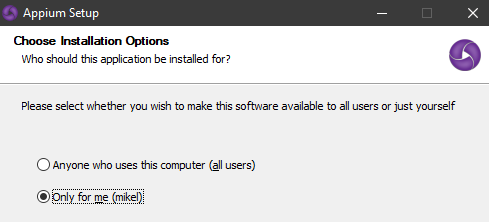

### Introduction
Nexial internally uses <a href="https://appium.io/" class="external-link" target="_nexial_link">Appium</a> to 
communicate with the target device. Appium is a well-known "_open source test automation framework for use with native, 
hybrid and mobile web applications_" (http://appium.io). By utilizing Appium, Nexial provides a code-free mobile testing 
solution that is proven and standards-based. Nexial engineers (_that's you!_) get the best of both worlds! 

In order to enable mobile testing in Nexial, one would need to first install and configure Appium locally. To manage 
the Appium runtime both externally and internally, and the ability to inspect the mobile application elements, below are 
the list of additional software to install. Follow these links to download these open-source software and install them 
on your system.


### Install Node.js
- Get <a href="https://nodejs.org/en/download/" class="external-link" target="_nexial_link">**Node.js**</a>
- Node.js (or simply _node_) will be used to launch Appium from within Nexial execution. This is also known as 
  "Appium local service", in which Appium is started and terminated from within an execution. This technique provides 
  better control and less runtime dependencies. It also means that the target device must be locally available 
  (either connected or running as emulator).
- Be sure to select the appropriate installer as per your system. For Windows user, if you are not sure, follow the 
  steps listed in <a href="https://support.microsoft.com/en-us/windows/32-bit-and-64-bit-windows-frequently-asked-questions-c6ca9541-8dce-4d48-0415-94a3faa2e13d"
  class="external-link" target="_nexial_link">32-bit and 64-bit Windows</a> to find out if you have 32-bit or 64-bit 
  Windows.
- The installation process is straight-forward:
  - Accept the license agreement,
  - Note the installation folder (Needed for later step),
  - Click the NEXT buttons as they appear; accept default installation settings.
- Set up an environment variable **`NODE_BINARY_PATH`** based on the installation location of Node.js. For example, if 
  Node.js is installed to `C:\Program Files\NodeJs` (Windows default), then create the following environment variable:
  <br/>
  <br/>
  For more details on creating environment variable, check out 
  <a href="https://support.shotgunsoftware.com/hc/en-us/articles/114094235653-Setting-global-environment-variables-on-Windows" 
  class="external-link" target="_nexial_link">Setting global environment variables on Windows</a><br/><br/>
  For MacOS/*NIX, `node` is likely installed to `/usr/local/bin/`:
  ```
  export NODE_BINARY_PATH=/usr/local/bin/node
  ```

### Install Appium Desktop 
- Get <a href="https://github.com/appium/appium-desktop/releases/latest" class="external-link" target="_nexial_link">**Appium Desktop**</a>
- Appium Desktop provides a variety of functionalities:
  - Bundled with Appium server (or service), which can be initiated via Appium Desktop (UI) or via Nexial (using 
    Node.js).
  - UI for Appium server to for customization and advanced settings.
  - Inspector functionality to provide basic interactivity with your target mobile application and exposes the 
    element locators for your target mobile application. Both of these capabilities are critical towards the 
    authoring of your mobile automation.
    
- To install Appium Desktop, follow the above link and select the appropriate distro for your system.
- In most cases, the default installation options should suffice. 
  - Note that on Windows, if you choose to install Appium Desktop so that it is available for all users (of the same 
    system), then local admin access is required. As such the installation directory is likely 
    `C:\Program Files\Appium`. If you choose to install Appium Desktop only for yourself, then the installation 
    directory will likely be `C:\Users\<user_id>\AppData\Local\Programs\Appium`.
    
  - On MacOS, it is recommended to install Appium Desktop under `/Applications/Appium.app`.
- Set up an environment variable **`APPIUM_BINARY_PATH`** based on the installation location of Appium Desktop. The
  value of this environment variable should be `<APPIUM_HOME>/resources/app/node_modules/appium/build/lib/main.js`. For
  example, <br/>
  On Windows:<br/>
  <br/>
  On MacOS/*NIX:
  ```
  APPIUM_BINARY_PATH=/Applications/Appium.app/Contents/Resources/app/node_modules/appium/build/lib/main.js
  ```


### Running Appium
As mentioned in the [section above](#install-appium-desktop), one can use Appium Desktop to configure, to start and to 
stop Appium server. However, in order to support Nexial automation both locally and remotely, consider enable the 
following options:
- Specify either hostname or machine IP.<br/>
  
- Under Advanced tab, check "Allow CORS", "Allow Session Override" and "Relaxed Security"<br/>
  

These settings allow the Appium server instance would be reachable remotely and hence allows for remote automation. 
As a convenience, one may choose to save the setting as a preset.

While using Appium Desktop is simple and convenient, it isn't great for Continuous Testing where the test execution 
might be invoked via scripts and conducted remotely (think CI/CD). Alternative to Appium Desktop, one can also run 
Appium server via command line. This approach is both script-friendly and CI/CD ready. Below is an example of such 
script:<br/>
On Windows:<br/>
```
cd %APPIUM%\resources\app\node_modules\appium\build\lib
node main.js --allows-cors -a <LOCAL-IP-OR-HOSTNAME> -p 4723 --session-override --no-perms-check --relaxed-security
```

On MacOS:<br/>
```
cd $APPIUM/Contents/Resources/app/node_moduels/appium/build/lib
node main.js --allows-cors -a <LOCAL-IP-OR-HOSTNAME> -p 4723 --session-override --no-perms-check --relaxed-security
```


For more Appium runtime options, consult the official 
<a href="https://appium.io/docs/en/writing-running-appium/server-args/" class="external-link" target="_nexial_link">
Appium server arguments</a> documentation.


### Additional Notes
If it is configured to run Appium server from within a Nexial execution, Nexial will make a number of attempts to 
resolve the installation directory of both Node.js and Appium. It does so via searching through commonly known paths. 
If you have installed Node.js or Appium in a custom location, please set the following local environment variables:

```
NODE_BINARY_PATH=<location of node.exe or node executable>
APPIUM_BINARY_PATH=<installation location of Appium/Appium Desktop>/resources/app/node_modules/appium/build/lib/main.js
```
