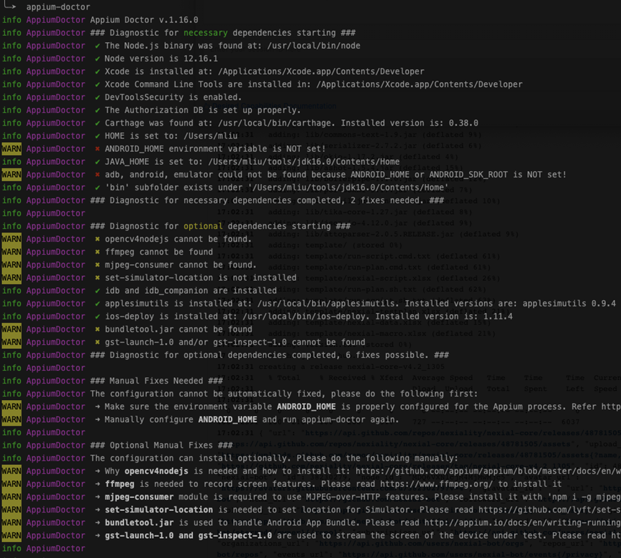

### Introduction
It is common knowledge that the iOS automation can only be performed on Apple's hardware - iOS-supported device or 
MacOS system like MacBook and iMac. However, with Nexial it is possible to execute mobile automation remotely from a 
non-Apple hardware. This means that you can run your automation scripts (Nexial) from a Windows or Linux system, and the
corresponding commands execute on a remote MacOS system. In addition, one can employ cloud test platform such as 
<a href="https://www.browserstack.com" class="external-link" target="_nexial_link">BrowserStack</a> to enable remote
automation. Note that for local testing on real devices, the iOS-supported devices must be connected to a MacOS system.

Before iOS automation can be performed, we must first prepare the target MacOS system. This involves a series of 
one-time software installation (all free). Follow the guide below to complete the installation and preparation 
work.

Note that most of the information below derived from other websites, particularly from:
- <a href="https://krishnachetan.medium.com/setup-appium-on-mac-1e06f1178427" class="external-link" target="_nexial_link">Setup Appium on MacOS for Android and iOS App Automation</a> 
- <a href="https://appiumpro.com/" class="external-link" target="_nexial_link">Appium Pro</a>


### Pre-requisites 
- macOS 10.11 or higher (latest recommended)
- iOS device with iOS 9.3 or higher (latest recommended)
- Enough storage to install XCode, NodeJS and a series of free software (below). Approximately 
  <a href="https://georgik.rocks/how-to-install-xcode-12-with-small-available-disk-space/">40 GB</a>.


### Installing Required Software

#### Install Latest XCode
1. Install the latest XCode from <a href="https://apps.apple.com/us/app/xcode/id497799835?mt=12" class="external-link" target="_nexial_link">Mac App Store</a>
2. Install XCode command line tools
```
xcode-select --install
sudo xcode-select -r
```
3. Change permission and accept xcode license
```
sudo chown -R $(whoami) /usr/local/share/man/man5 /usr/local/share/man/man7
sudo xcodebuild -license accept
```

#### Install Appium Desktop
- Navigate to <a href="https://github.com/appium/appium-desktop/releases" class="external-link" target="_nexial_link">appium-desktop release page</a>.
- Select the distro for Mac version (i.e. `Appium-mac-....dmg`) to download.
- When the download finishes, double-click the `.dmg` file. Then drag and drop the Appium icon into the Application icon.
- Follow the additional environment set up documented in [Install and Configure Appium](install_appium)

#### Install Homebrew (for managing missing packages and dependencies) from https://brew.sh
Open a terminal session and enter the following command:
```
/bin/bash -c "$(curl -fsSL https://raw.githubusercontent.com/Homebrew/install/master/install.sh)"
```

#### Install Support Software for Appium and iOS Automation
[comment]: ( 3rd-party permission magic / hardware keyword)
[comment]: (support MobileSafari and UIWebViews on real/simulated iOS devices)
[comment]: (FUSE implements a mechanism that makes it possible to implement a fully functional file system in a user-space program on macOS)
[comment]: (idb / iOS development bridge / cli for automating iOS / https://github.com/facebook/idb)
[comment]: (install/debug iOS app from cli)
[comment]: (permission for xcuitest / sim. utils)
Open a terminal session and enter the following commands (OK to run a few lines as a time):
```
brew install carthage
brew install node

brew tap wix/brew
brew install wix/brew/applesimutils

brew install ios-webkit-debug-proxy
brew install osxfuse
brew install ifuse

brew tap facebook/fb
brew install idb-companion
pip3 install fb-idb --user
brew install fbsimctl

brew install libimobiledevice
brew install ios-deploy
npm install -g authorize-ios
brew install ideviceinstaller
```

#### Install appium-doctor
Appium Doctor checks most of the preconditions for Appium to run successfully. In order to install it, run the 
following command:
```
npm install -g appium-doctor
appium-doctor
```



Check log (example above) to ensure that all the required components are properly installed.


### Additional Notes

