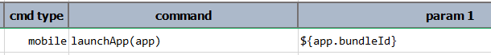

### Description
This command instructs Nexial to launch or activate an app on the current device. Using this command, one can launch 
both custom apps, common apps and System apps. The `app` parameter would be either the `bundleId` for iOS platform or 
the `appId` for Android platform. The target app should be installed on the device prior to the invocation of this 
command. If the target app is already running in the background, this command will bring it to the foreground. 

### For Android platform
To find the `appId` for an Android apps, one may use either Nexial's `nexial-apk-manifest` utility script or Google 
Play Store.

#### Use nexial-apk-manifest.cmd|sh


#### Via Google Play Store or Specialized Android app
Follow the steps documented here:
<a href="https://www.techmesto.com/find-android-app-package-name/" class="external-link" target="_nexial_link">Find 
  package name or application ID of an Android app</a> 

#### Common Android `appId`
Here are some common Android apps to try:

| app                               | `appId`                                   |
|:----------------------------------|:------------------------------------------|
| Android Live Wallpapers	          | `com.android.wallpaper`                   |
| Calculator                        | `com.android.calculator2`                 |
| Calendar	                        | `com.android.calendar`                    |
| Contacts	                        | `com.android.contacts`                    |
| Dialer	                          | `com.android.phone`                       |
| Email	                            | `com.android.email`                       |
| Gmail	                            | `com.google.android.gm`                   |
| Google Search	                    | `com.google.android.googlequicksearchbox` |
| Messaging	                        | `com.android.mms`                         |
| Music	                            | `com.android.music`                       |
| Network Location	                | `com.google.android.location`             |
| News & Weather	                  | `com.google.android.apps.genie.geniewidget`|
| Settings	                        | `com.android.settings`                    |
| Speech Recorder	                  | `com.android.speechrecorder`              |
| Status Bar	                      | `com.android.systemui`                    |
| Street View	                      | `com.google.android.street`               |
| Talk	                            | `com.google.android.talk`                 |
| Task	                            | `com.android.task`                        |
| Youtube                           | `com.google.android.youtube`              |
|+---------------------------------+|+-----------------------------------------+|

 

### For iOS platform


As a convenience, here are a list of common iOS apps and their respective `bundleId`:

| app                               | `bundleId`                                |
|:----------------------------------|:------------------------------------------|
| Home Screen/Application Launcher  | `com.apple.springboard`                   |
| AirPort Utility                   | `com.apple.airport.mobileairportutility`  |
| App Store                         | `com.apple.AppStore`                      |
| Apple Maps                        | `com.apple.Maps`                          |
| Calculator                        | `com.apple.calculator`                    |
| Calendar                          | `com.apple.mobilecal`                     |
| Camera                            | `com.apple.camera`                        |
| Clock                             | `com.apple.mobiletimer`                   |
| Compass                           | `com.apple.compass`                       |
| Contacts                          | `com.apple.MobileAddressBook`             |
| FaceTime                          | `com.apple.facetime`                      |
| Find Friends                      | `com.apple.mobileme.fmf1`                 |
| Find iPhone                       | `com.apple.mobileme.fmip1`                |
| Game Center                       | `com.apple.gamecenter`                    |
| GarageBand                        | `com.apple.mobilegarageband`              |
| Health                            | `com.apple.Health`                        |
| Keynote                           | `com.apple.Keynote`                       |
| Mail                              | `com.apple.mobilemail`                    |
| Maps                              | `com.apple.Maps`                          |
| Messages                          | `com.apple.MobileSMS`                     |
| Music Memos                       | `com.apple.musicmemos`                    |
| Music                             | `com.apple.Music`                         |
| News                              | `com.apple.news`                          |
| Notes                             | `com.apple.mobilenotes`                   |
| Passbook                          | `com.apple.Passbook`                      |
| Phone                             | `com.apple.mobilephone`                   |
| Photos                            | `com.apple.mobileslideshow`               |
| Podcasts                          | `com.apple.podcasts`                      |
| Reminders                         | `com.apple.reminders`                     |
| Safari                            | `com.apple.mobilesafari`                  |
| Settings                          | `com.apple.Preferences`                   |
| Stocks                            | `com.apple.stocks`                        |
| Tips                              | `com.apple.tips`                          |
| Videos                            | `com.apple.videos`                        |
| Voice Memos                       | `com.apple.VoiceMemos`                    |
| Wallet                            | `com.apple.Passbook`                      |
| Watch                             | `com.apple.Bridge`                        |
| Weather                           | `com.apple.weather`                       |
| iBooks                            | `com.apple.iBooks`                        |
| iMovie                            | `com.apple.iMovie`                        |
| iTunes Store                      | `com.apple.MobileStore`                   |
| iTunes U                          | `com.apple.itunesu`                       |
|+---------------------------------+|+-----------------------------------------+|

 
### Parameters
- **app** - The `appID` (Android) or `bundleId` (iOS) of the target app.

### Example

### See Also
- [`closeApp()`](closeApp())
- [`recentApps()`](recentApps())
