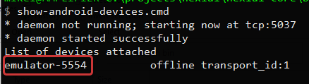

### Introduction
Nexial uses the concept of "profile" to configure your target mobile device, much like how a profile is used in
[`aws.ses`](../aws.ses), [`aws.s3`](../aws.s3), [`aws.sqs`](../aws.sqs), [`ssh`](../ssh), [`web`](../web), 
[`webmail`](../webmail), [`mail`](../mail), etc. Using a "profile", one configure a set of settings for a specific 
device target. This also means that one could create multiple profiles, each for a specific device target, and toggle 
amongst them as needed. Nexial extends of the idea of data-driven automation via this "profile" concept so that the 
corresponding script would be resilient against configuration changes cause by device target.

A profile is essentially a set of configurations with a shared prefix (aka profile name). These configurations can be
defined in a datasheet or [`project.properties`](../../userguide/UnderstandingProjectStructure#artifactprojectproperties).
A profile is referenced by the [`use(profile)`](use(profile)) command to start a mobile automation session. Consequently,
the same [`use(profile)`](use(profile)) command should be considered as the first command to invoke when perform mobile 
testing, so that the appropriate device context and appium runtime is instantiated.


### Configuration
Here are the common configurations for any device target:
(assuming profile name as `PHONE`)

| configuration                        | value                    | notes                                          |
|+------------------------------------+|+------------------------+|+----------------------------------------------+|
|`PHONE.type`	                         | `android` or `ios`       | **(REQUIRED)**                                 |       
|`PHONE.server.url`	                   | `(empty)`or `http://...` | specify an externally managed Appium server URL. If none is specified, Nexial will start Appium server internally and terminate it when the execution is complete. |
|`PHONE.server.logging`	               | `true` or `false`        | if `true`, Appium-specific logs will be created under `<OUTPUT>/logs/appium.log`. | 
|`PHONE.nexial.mobile.sessionTimeoutMs`| (default) 300000         | override [`System variable of the same name`](../../systemvars/index.html#nexial.mobile.sessionTimeoutMs). |
|`PHONE.nexial.mobile.postActionWaitMs`| (default) 0              | override [`System variable of the same name`](../../systemvars/index.html#nexial.mobile.postActionWaitMs). |
|`PHONE.nexial.mobile.explicitWaitMs`	 | (default) 5000           | override [`System variable of the same name`](../../systemvars/index.html#nexial.mobile.explicitWaitMs).   |
|`PHONE.nexial.mobile.implicitWaitMs`	 | (default) 0              | override [`System variable of the same name`](../../systemvars/index.html#nexial.mobile.implicitWaitMs).   |
|`PHONE.nexial.mobile.hideKeyboard`	   | (default) true           | override [`System variable of the same name`](../../systemvars/index.html#nexial.mobile.hideKeyboard).     |
|`PHONE.geoLocation`	                 | (Emulator only)          | simulate another location via (longitude,latitude). For example `46.457398,-119.407305`. |
|+------------------------------------+|+------------------------+|+----------------------------------------------+|

<br/>Nexial supports all the <a href="https://appium.io/docs/en/writing-running-appium/caps/" class="external-link"
target="_nexial_link">Appium Desired Capabilities</a>. Simply prefix the capability name in question with the profile
name. For example,

| configuration          | purpose                                | reference under Appium Desired Capabilities    |
|+----------------------+|+--------------------------------------+|+----------------------------------------------+|
|`PHONE.deviceName`	     | The target device name                 |  General Capabilities &raquo; `deviceName`     |
|`PHONE.platformVersion` | Mobile OS version                      | General Capabilities &raquo; `platformVersion` |
|`PHONE.udid`	           | **U**nique **D**evice **Id**entifier   | General Capabilities &raquo; `udid`            |
|`PHONE.app`	           | Location of target app                 | General Capabilities &raquo; `app`             |
|`PHONE.orientation`	   | (Emulator only) start application in a certain orientation | General Capabilities &raquo; `orientation` |
|`PHONE.appPackage`      | (Android only) package of the target app | Android Only &raquo; `appPackage`            |
|`PHONE.appActivity`	   | (Android only) the activity name to wait for | Android Only &raquo; `appPackage`        |
|+----------------------+|+--------------------------------------+|+----------------------------------------------+|

Note that some platform or driver specific capabilities contain `:`, which can be an issue if you use
[`project.properties`](../../userguide/UnderstandingProjectStructure#artifactprojectproperties) to define your device 
profile. In such case, be sure to "escape" the colon characters, like this:

```
PHONE.appium\:simulatorStartupTimeout=120000
PHONE.appium\:enableWebviewDetailsCollection=true
PHONE.appium\:maxInstances=1
```

[comment]: <> (# real device)
[comment]: <> (# xcodeOrgId)
[comment]: <> (# xcodeSigninId)
[comment]: <> (# waitForQuiescence)
[comment]: <> (# enable useNewWDA / ioS ClassChain)

-----

### Finding UDID
There are multiple ways to finding UDID of your target devices, emulators or simulators.

#### For Android devices
Use Nexial's `show-android-devices` utility script to find actively connected devices and emulators.

For **Windows**:
```
cd %NEXIAL_HOME%
cd bin\mobile
show-android-devices.sh
```

For **Linux/MacOS**:
```
cd $NEXIAL_HOME
cd bin/mobile
./show-android-devices.sh
```

Here's an example output:<br/>


The highlighted portion is the UDID for the connected device/emulator.

#### For iOS devices


-----

### Finding `appId`, `appPackage`, `appActivity` or `bundleId` (iOS)
#### Approach 1: Use Nexial's `nexial-apk-manifest` utility script


#### Approach 2: (Android only) Via Google Play Store
<a href="http://www.automationtestinghub.com/apppackage-and-appactivity-name/">2 Ways to find appPackage and appActivity name of your App</a>

#### Approach 3: (iOS only) Use Nexial's `show-ios-bundleid.sh` utility script


