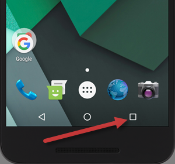

### Description
For Android device, this would be equivalent to pressing the bottom-right "square" icon:

For iOS device, this would be equivalent to returning to the Home screen of the current device.

### Parameters

### Example

### See Also
- [`closeApp()`](closeApp())
- [`launchApp(app)`](launchApp(app))
