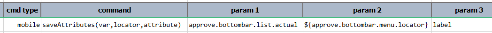

### Description
This command searches for all elements matching to the specified `locator`, collects the value of the specified 
`attribute` from these elements, and saves these values as a LIST to a data variable denoted as `var`. If no element is
found to match `locator`, then `var` will be removed to avoid confusion. For each matching element, Nexial will attempt
to collect the value of `attribute` from it. It is quite possible that the specified `attribute` might not exist on one 
or more of the matching elements. In such case, a `null` value will be collected to represent such condition. 




### Parameters
- **var** - the data variable to save the collected attribute values 
- **locator** - to match one or more elements
- **attribute** - the attribute to inspect and collect

### Example

### See Also
- [`saveText(var,locator)`](saveText(var,locator))
- [`saveTextArray(var,locator)`](saveTextArray(var,locator))
