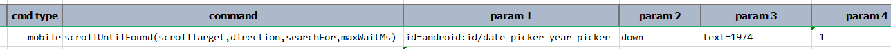

### Description
This command aims to find a specific element within a scrollable container/target. This command uses scrolling, in
the `direction` specified, until the specified element is found. Here are more details for this command:
1. Use `scrollTarget` as the locator of the element on which the scrolling is to be performed
2. Use `direction` as the direction of the scrolling to perform. The possible directions are (case-insensitive): `up`, 
   `down`, `left` and `right`.
3. As each scrolling is performed, Nexial will search for the presence of an element using `searchFor` as the locator.
4. The `maxWaitMs` indicates how much time would be tolerated - in milliseconds - before failing the corresponding step.
   Use `-1` or `(empty)` to indicate that no timeout should be considered.

This command can prove useful when the exact location of the intended element cannot be determined beforehand. 

Note:
- The `scrollTarget` parameter must resolve to a scrollable element which contains the `searchFor` element.
- The `direction` parameter must be `up`, `down`, `left` or `right`. Either uppercase or lowercase would do.

### Parameters
See above

### Example

### See Also
- [`scroll(locator,direction)`](scroll(locator,direction))
