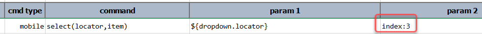
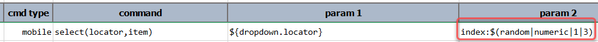

### Description
This command instructs Nexial to select `item` from the dropdown component denoted by `locator`. The specified `item`
must be one of the values in the target dropdown component. Otherwise, the corresponding step will likely fail. 
Alternatively, one can use the `index:` prefix to denote an item of the dropdown based on its index. For example,

The above example shows how one can select the 4th option of the dropdown component denoted by `${dropdown.locator}`. 
Note that **index value is 0-based** (i.e. `3` means the 4th available item from the top).

Consequently, one can use the Nexial function [`$(random)`](../../functions/$(random)) to derive at a randomized index,
thus giving some variation to the execution:

When selecting a dropdown option by its text on an Android device, one may employ PolyMatcher to yield a more dynamic
and possibly more resilient automation. PolyMatcher allows one to select a dropdown option based on various matching 
logic such as "CONTAIN", "CONTAIN CASE-INSENSITIVELY", "START WITH", etc.

Lastly, the `locator` parameter should represent the component that would trigger the rendering of a dropdown, not the
dropdown component itself. Nexial will attempt to find and activate (i.e. click) on the component represented by the
`locator` argument, and then automate the selection of a dropdown option based on the `item` argument.





### Parameters
- **locator** - the locator of the component that would trigger the rendering of a dropdown.
- **item** - the item (text or index) to select from the rendered dropdown. For index-based selection, use `index:...` 
  syntax. Note that index is 0-based.

### Example
See examples above

### See Also
