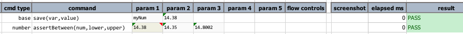

### Description
This command asserts `num` is between `min` and `max` value, inclusively.

### Parameters
- **num** - the number to assert
- **min** - the value which `num` must be greater or equal to
- **max** - the value which `num` must be less or equal to

### Example
**Script**: 

**Output**: 

