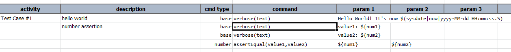

### Description
This command asserts equality between two numbers

### Parameters
- **value1** - expected number
- **value2** - actual number to assert against `value`

### Example
Note that `${num1}` and `${num2}` are declared in the corresponding data file.

Here's an example on how to use this command: 

The output displays the values of num1 and num2 and then makes the assertion of these two values: 
