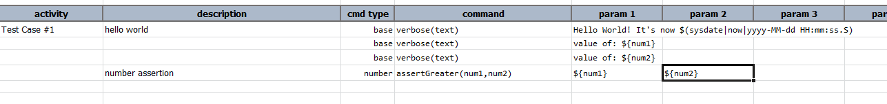
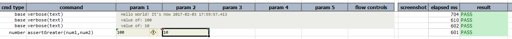

### Description
This command asserts that `num1` is numerically larger than `num2`.

### Parameters
- **num1** - first number, which should be larger than the second
- **num2** - second number

### Example
Note that `${num1}` and `${num2}` are declared in the corresponding data file.

Here is an example to use this command. `num1` is expected to be greater than `num2`. 

The output displays the two numbers and then makes the assertion to check if `num1` is greater than `num2`.

