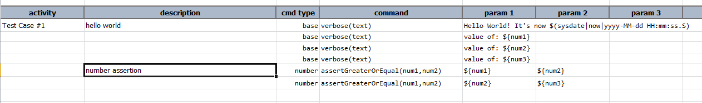
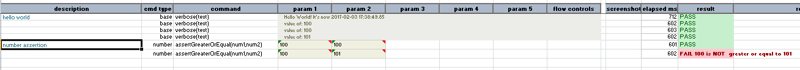

### Description
This command asserts that `num1` is numerically the same or larger than `num2`.

### Parameters
- **num1** - number expected to be equal or greater than the second number
- **num2** - the second number

### Example
Note that `${num1}`, `${num2}` and `${num3}` are declared in the corresponding data file.

The given example displays the values of three numbers and the first assertion is made to check for the equality. 
The second assertion is to check if `num1` is same or greater than `num2`. 

The output displays all the three numbers used for assertion. First assertion to check the equality and the second 
assertion is a failed scenario to check the greater value: 

