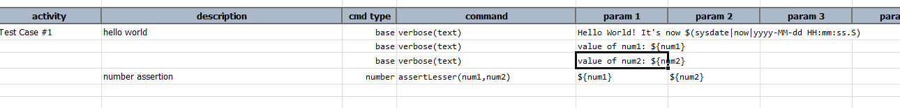
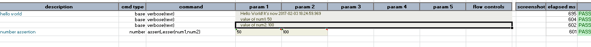

### Description
This command asserts that `num1` is numerically less than `num2`

### Parameters
- **num1** - the first number that should be less than the second number
- **num2** - the second number

### Example
Note that `${num1}` and `${num2}` are declared in the corresponding data file.

Here is an example to see the usage of this command. 

Output is here that displays the two values and then makes the assertions that the first number is less than the 
second number of not. 

