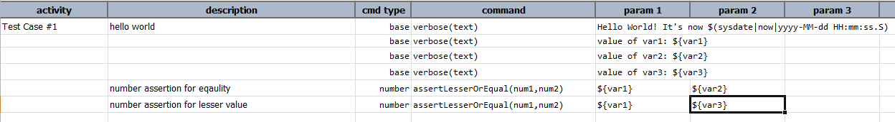
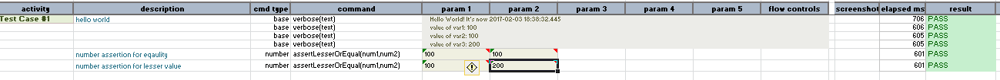

### Description
This command asserts that `num1` is numerically equal or less than `num2`

### Parameters
- **num1** - the first number that is expected to be same or less than the second
- **num2** - the second number

### Example
Note that `${num1}` and `${num2}` are declared in the corresponding data file.

Here is an example to assert that first number is equal or less than the second number: 

**Output** 

