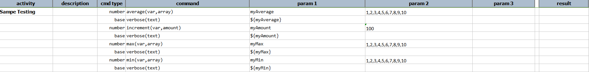
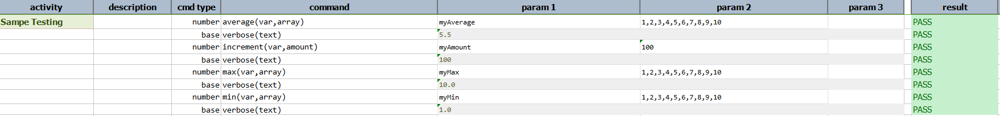

### Description
This command calculates the average of a series of numbers represented by `array`.  The average value is stored as 
`var`

### Parameters
- **var** - the variable to store the average
- **array** - the array of numbers for which average need to be calculated

### Example
**Script**: 

**Output**: 

### See Also
- [`ceiling(var)`](ceiling(var))
- [`floor(var)`](floor(var))
- [`increment(var,amount)`](increment(var,amount))
- [`max(var,array)`](max(var,array))
- [`min(var,array)`](min(var,array))
- [`round(var,closestDigit)`](round(var,closestDigit))
