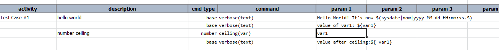
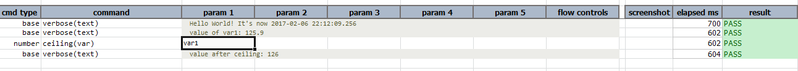

### Description
This command returns the closest integer value of `var` that is just below (less) `var`'s original value.  This is
synonymous to the concept of "round down".

### Parameters
- **var** - the variable that holds the number to round down.

### Example
Note that `${var1}` is declared in the corresponding data file.

Here is the example for the usage of this command. `var1` is the variable defined test data with value `125.9` 

Here is the output that displays variable value after returning its closest integer value 

### See Also
- [`average(var,array)`](average(var,array))
- [`floor(var)`](floor(var))
- [`increment(var,amount)`](increment(var,amount))
- [`max(var,array)`](max(var,array))
- [`min(var,array)`](min(var,array))
- [`round(var,closestDigit)`](round(var,closestDigit))