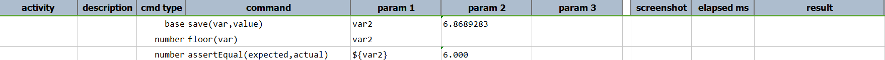
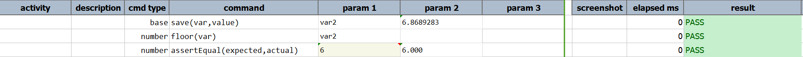



### Description
This command returns the closest integer value of `var` that is just above (greater than) `var`'s original value.  
This is synonymous to the concept of "round up".

### Parameters
- **var** - the variable that holds the number to round up.

### Example

Output: 

### See Also
- [`ceiling(var)`](ceiling(var))
- [`average(var,array)`](average(var,array))
- [`increment(var,amount)`](increment(var,amount))
- [`max(var,array)`](max(var,array))
- [`min(var,array)`](min(var,array))
- [`round(var,closestDigit)`](round(var,closestDigit))