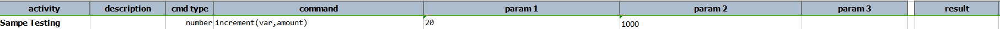
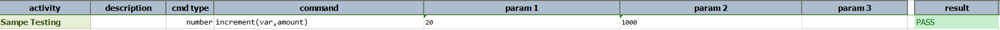

### Description
This command increments the number represented by `var`.  If `var` is not found, the value `amount` will be created for 
`var`.

### Parameters
- **var** - the variable to increment
- **amount** - the amount to increment

### Example
**Script**: 

**Output**: 

### See Also
- [`max(var,array)`](max(var,array))
- [`min(var,array)`](min(var,array))