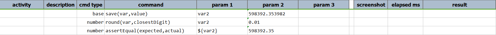
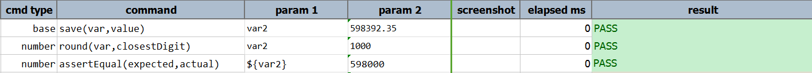

### Description
This command round the number represented by `var` to the nearest digits (integer) and stores it back to `var`.

### Parameters
- **var** \- the value to be rounded.
- **closestDigit** \- the nearest digit to be rounded.

### Example 

**Output**: 

### See Also
- [`ceiling(var)`](ceiling(var))
- [`floor(var)`](floor(var))
