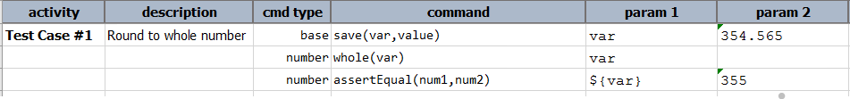
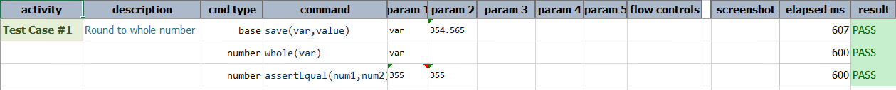

### Description
This command round the number represented by `var` as a whole number (integer) and stores it back to `var`.

### Parameters
- **var** - the value to be rounded as the whole number i.e. integer.

### Example 

**Output**: 

### See Also
- [`ceiling(var)`](ceiling(var))
- [`floor(var)`](floor(var))
