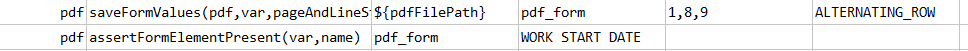

### Description
This command asserts the form element is present in the pdf document.   



### Parameters
- **var** - the variable that stores previously parsed PDF form data
- **name** - the form element name to check

### Example
**Script**: 

**Output**: 

### See Also
- [`saveFormValues(pdf,var,pageAndLineStartEnd,strategy)`](saveFormValues(pdf,var,pageAndLineStartEnd,strategy))
- [`assertFormValue(var,name,expected)`](assertFormValue(var,name,expected))
- [`assertFormValues(var,name,expectedValues,exactOrder)`](assertFormValues(var,name,expectedValues,exactOrder))
