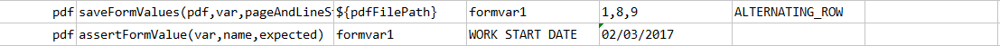
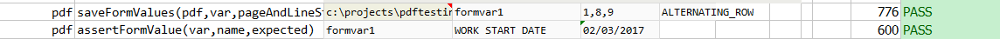

### Description
This command asserts the form value in the pdf document is as `expected`.



### Parameters
- **var** - the variable that stores previously parsed PDF form data
- **name** - the name of the form element to validate
- **expected** - the expected value of that form element

### Example
**Script**: 

**Output**: 

### See Also
- [`saveFormValues(pdf,var,pageAndLineStartEnd,strategy)`](saveFormValues(pdf,var,pageAndLineStartEnd,strategy))
- [`assertFormValues(var,name,expectedValues,exactOrder)`](assertFormValues(var,name,expectedValues,exactOrder))
- [`assertFormElementPresent(var,name)`](assertFormElementPresent(var,name))
