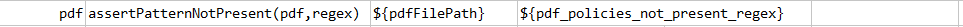
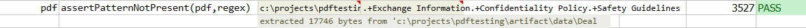



### Description
This command asserts the given text pattern (`regex`) is **NOT** present in `pdf`.

### Parameters
- **pdf** \- the PDF file to validate
- **regex** \- regular expression to validate if `pdf` DOES NOT contains expected text pattern

### Example
**Script**: 

**Result**: 

### See Also
- [`assertPatternPresent(pdf,regex)`](assertPatternPresent(pdf,regex))
- [`assertTextPresent(pdf,text)`](assertTextPresent(pdf,text))
- [`assertTextNotPresent(pdf,text)`](assertTextNotPresent(pdf,text))
