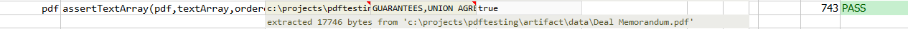

### Description
This command asserts the content in `pdf` contains each of the text element in `textArray`.  Use `ordered` to assert 
if the order of `textArray` must be followed.

Note that this **DOES NOT** mean that the text element specified in `textArray` must be strictly adjacent to each other
in the `pdf` content. In other words, it is permissible to other text between the elements specified in `textArray`.
Furthermore, if `ordered` is `false`, the order to each element of `textArray` is to be found need NOT be strictly 
enforced in `pdf` content.

### Parameters
- **pdf** - the PDF file to validate
- **textArray** - the expected list of text
- **ordered** - `true` if the order of `textArray` must be present in `pdf` in the same order

### Example
If the ordered parameter in the command is set as **true**, expected and actual are asserted for the same order. 
If set as **false**, it will ignore the order.

**Script**: 

**Output**: 

