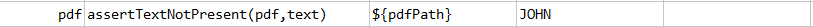

### Description
This command asserts the given text is not present in `pdf`.

### Parameters
- **pdf** \- the PDF file to validate
- **text** \- the text that is expected NOT to be found in `pdf`.

### Example
**Script**: 

**Result:** 

### See Also
- [`assertPatternPresent(pdf,regex)`](assertPatternPresent(pdf,regex))
- [`assertPatternNotPresent(pdf,regex)`](assertPatternNotPresent(pdf,regex))
- [`assertTextPresent(pdf,text)`](assertTextPresent(pdf,text))
