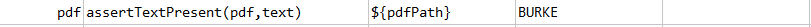

### Description
This command asserts the given text is present in `pdf`.

### Parameters
- **pdf** - the PDF file to validate
- **text** - the text expected to be found in `pdf`

### Example
**Script**: 

**Output**: 

### See Also
- [`assertPatternPresent(pdf,regex)`](assertPatternPresent(pdf,regex))
- [`assertPatternNotPresent(pdf,regex)`](assertPatternNotPresent(pdf,regex))
- [`assertTextNotPresent(pdf,text)`](assertTextNotPresent(pdf,text))
