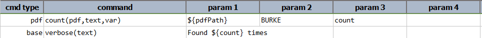
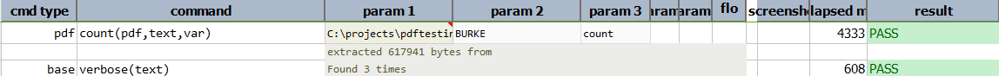

### Description
This command counts the number of occurrences of `text` in `pdf`. The result count will be stored in `var`.

### Parameters
- **pdf** - the PDF file to validate
- **text** - the text to count
- **var** - variable to store the count of `text` in `pdf`

### Example
**Script**: 
  

**Output**: 

