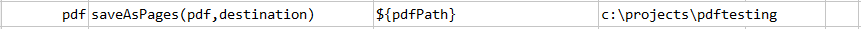
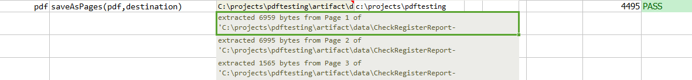
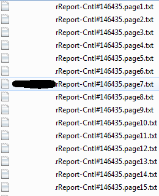

### Description
This command saves `pdf` in text file, into individual pages.  Each page in pdf document will be saved as 
a seperated text file in `destination`.

### Parameters
- **pdf** - the PDF file to process
- **destination** - destination path where the text will be stored

### Example
In the given pdf document, it has 94 pages. All 94 pages will be saved as 94 text files in the destination folder.

**Script**: 

**Output**: 

Text file names are appended with page number as shown: 

