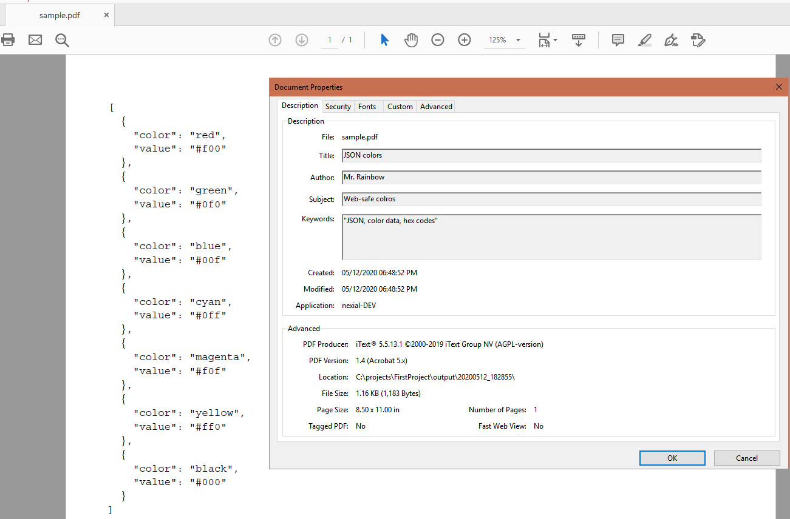
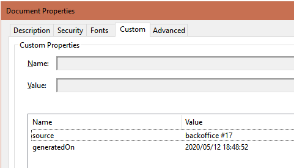

### Description
This command saves the specified `content` as a PDF file (denoted as `pdf`). One can utilize the `profile` parameter
to customize various output setting for the PDF generation. Suppose the intended profile is named as `pdfOutput`. We
can have the following set of output configurations:

1. `[profile].pagesize` - specify the page size of the target PDF file. 
   - One may use common page sizes such as `LETTER`, `LEGAL`, `LEDGER`, `TABLOID`, `POSTCARD`, `A0`, `A1`, `A2`, `A3`, 
     `A4`, `A5`, `A6`, etc., or specify a custom page size in the format `<inches>x<inches>`. 
   - For example, `11x8.5` would instruct Nexial to create a landscape-oriented, Letter-sized PDF (normal portrait 
     Letter size is `8.5x11`).
2. `[profile].monospaced` - indicate whether Nexial should output the specified content in fixed width font (e.g. 
   Courier). Default is `false`. 
   - generally speaking, one would set this configuration to `true` when the intent is to generate the `content` as 
     "source code". For HTML content, set this configuration to `false`. 
3. `[profile].title` - specify the title of the generated PDF. This metadata would appear under the Properties tab of
   the generated PDF (see example). This configuration is optional.
4. `[profile].subject` - specify the subject of the generated PDF. This metadata would appear under the Properties tab 
   of the generated PDF (see example). This configuration is optional.
5. `[profile].author` - specify the author of the generated PDF. This metadata would appear under the Properties tab of 
   the generated PDF (see example). By default, this will reflect the User ID that executed the corresponding 
   Nexial automation.
6. `[profile].keywords` - specify the keywords of the generated PDF. This metadata would appear under the Properties 
   tab of the generated PDF (see example). This configuration is optional.
7. `[profile].custom.*` - specify additional custom metadata for the generated PDF. This metadata would appear under 
   the Custom tab of the generated PDF (see example).

### Parameters
- **profile** - the profile name of the intended output configuration.
- **content** - the content to be generated on the PDF
- **pdf** - the PDF file to process

### Example

**Script**: 

**Datasheet**: 

The **generated PDF and the generated metadata**: 
 

### See Also
- [`saveAsText(pdf,destination)`](saveAsText(pdf,destination))
