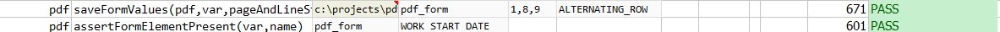

### Description
This command saves the form values from the pdf document and store the data in the given variable name.



### Parameters
- **pdf** - the PDF file to validate
- **var** - variable name to store the form data
- **pageAndLineStartEnd** - identify the starting page number, start line and end line. All the three values to be 
  given with comma separated
- **strategy** - the strategy to read the pdf form. See [Form Data Extraction](index.md#pdf-form-data-extraction) for 
  more details.

### Example
**Script**: 

**Output**: 

### See Also
- [`assertFormValue(var,name,expected)`](assertFormValue(var,name,expected))
- [`assertFormValues(var,name,expectedValues,exactOrder)`](assertFormValues(var,name,expectedValues,exactOrder))
- [`assertFormElementPresent(var,name)`](assertFormElementPresent(var,name))
