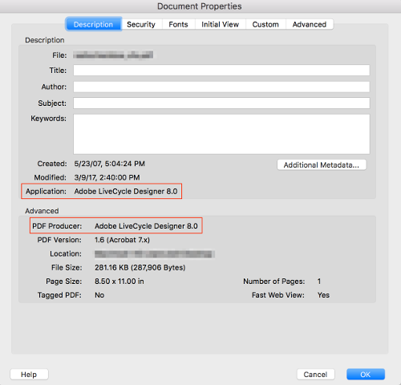
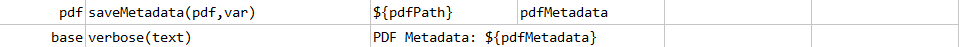
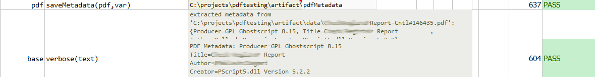

### Description
This command saves the metadata of `pdf` to `var`.  The metadata in reference here is that which specific to the 
Portable Document Format (PDF).

For example, here's an example of what one gets for a PDF document, via the Acrobat Reader: 

Nexial stores these metadata via the following names:
- `Title`
- `Author`
- `Subject`
- `Keywords`
- `CreateDate`
- `ModifyDate`
- `CreatorTool` 
- `Producer`
- `PDFVersion`
- `Subjects` (for PDF/A documents that confirmed to the XMP 2004 specification)
- `Creator` (for PDF/A documents that confirmed to the XMP 2004 specification)
- `Description` (for PDF/A documents that confirmed to the XMP 2004 specification)
- `Dates` (for PDF/A documents that confirmed to the XMP 2004 specification)

These metadata can be access via the specified `var`, like this:
`${var}.Author`, `${var}.ModifyDate`

### Parameters
- **pdf** - the PDF file to process
- **var** - the variable name to save metadata

### Example
**Script**: 

**Output**: 

