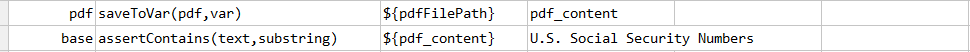
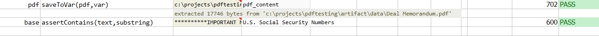

### Description
This command saves the content of `pdf` to a variable `var`.

### Parameters
- **pdf** - the PDF file to process
- **var** - the variable name to store the `pdf` content

### Example
**Script**: 

**Output**: 

