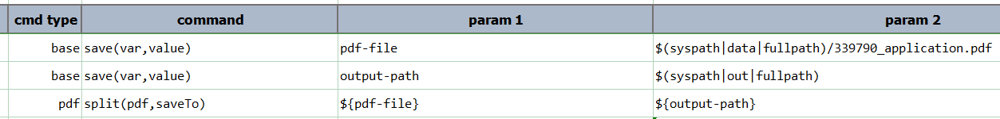
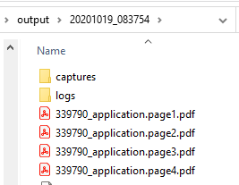

### Description
This command instructs Nexial to split `pdf` into individual PDF files of 1 page each. The split PDF files will be 
saved to `saveTo` location, using the following naming convention:

> Assuming `pdf` means `[directory where the PDF file is stored] + pdf_filename + [.pdf]`

> Then the split files will be savd to `saveTo` + `pdf_filename` + `.page` + [Page number starting from 1] + [.pdf]

Note that if any error is encountered, Nexial will attept to proceed to the subseuqent page(s) nonethtless. However
in such case, Nexial will also *FAIL* this command due to the error that was encountered.

### Parameters
- **pdf** - the fully qualified PDF file to split.
- **saveTo** - the location to save the split PDF file.

### Example
Script:

Output (split files):

### See Also
- [`combine(path,fileFilter,saveTo)`](combine(path,fileFilter,saveTo))
- [`saveAsPages(pdf,destination)`](saveAsPages(pdf,destination))
- [`savePageCount(pdf,var)`](savePageCount(pdf,var))
