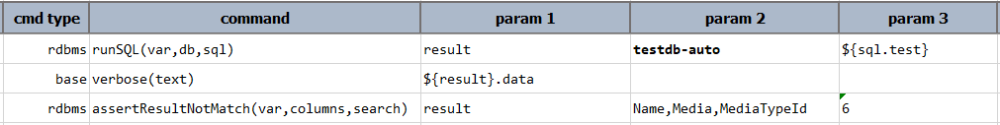

### Description
This command instructs Nexial to perform data validation on a previously executed query result, which is denoted by
`var`. This command asserts that the content of `search` does not exists in the specified `columns`. Note that if 
`var` does not resolve to a valid query result object, this command will result as `FAIL`.

One may limit the span of the data validation via the `columns` parameters. Specify the column(s) to validate against,
using [`nexial.textDelim`](../../systemvars/index#nexial.textDelim) as separator. Note that invalid columns are ignored.

The `search` parameter may contain 3 types of content for 3 different forms of data validation:
- `REGEX:...`: if `search` is prefixed with `REGEX:`, such as `REGEX:John .+`, then Nexial will match the specified 
  column(s) using regular expression.
- `CONTAIN:...`: if `search` is prefixed with `CONTAIN:`, such as `CONTAIN:123`, then Nexial will match the specified 
  column(s) using substring match.
- Otherwise Nexial will perform exact string match against the the specified column(s).
   

### Parameters
- **var** - the data variable of a previously executed query result
- **columns** - the column or columns to search
- **search** - the data to validate against; use `REGEX:` prefix for regular expression matching, `CONTAIN:` prefix for
  substring matching, or "as is" for exact matching.

### Example
**Script**: 

### See Also
- [`runSQL(var,db,sql)`](runSQL(var,db,sql))
- [`assertResultMatch(var,columns,search)`](assertResultMatch(var,columns,search))
