This collection of commands, as its name suggests, handle RDBMS-related automations and validations. As such, Nexial 
users can incorporate as test steps the actions or validations related to database as a part of a larger set of tests.
This provides many forms of benefit including test coverage, avoid data tainting, and widening test scope. Some 
examples of using the `rdbms` commands are:
1. automate data seeding or initialization procedures
2. automate data cleanup procedures
3. validate backend logic
4. direct manipulate of data in database to simulate exceptional conditions
5. execute stored procedures
6. simulate additional load to database (since running multiple clients at times are non-trivial or downright 
   impossible)


### Database Connection Setup
In order to interact with a database, such as running a query, the first thing is to set up the connection against 
the target database. A connection is a set of configuration (in Nexial data file) that describe how a database 
session can be established. It can be referenced by a single name, which allows for reusability and appropriate 
connectivity separation.

To describe a connection, add the following to the appropriate data file:


You can substitute `mydb` with something else more readable (**without dot**).

**IMPORTANT !!!** Note that only the following are required:
- `<connection name>` **.type** - this specifies the type of database to connect. Nexial will use this data to 
load the appropriate connection driver (a.k.a. JDBC driver). The valid values (currently supported drivers) are:
	 - **`db2`** (IBM DB2, JDBC type 4)
	 - **`mssql`** (Microsoft SQL Server)
	 - **`oracle`** (Oracle, JDBC type 4)
	 - **`postgresql`** (PostgreSQL)
	 - **`mysql`** (MySQL)
	 - **`sqlite`** (SQLite)
	 - **`hsqldb`** (HyperSQL)
	 - **`isam` or `connx`** (ISAM/Connx, JDBC type 2)
	 - **`mongodb`** (see [below](#connecting-to-mongodb) for more details)
	 - Note that to connect toother database not mentioned above, you may do the following:
	   1. add the appropriate JDBC Type 4 driver (jar file) to `${NEXIAL_HOME}/lib` directory.
	   2. add the appropriate driver class name to `<connection name>.JavaClassName` data variable (instead of 
	      `<connection name>.type`). Check the vendor's support page for the correct driver jar and driver classname.
- `<connection name>` **.url** - this specifies how to connect to the target database. Some connection string may 
  contain username and password. Hence the `.username` and `.password` are required. For more details about 
  connection string, check the following links:
  - <a href="https://msdn.microsoft.com/en-us/library/ms378428(v=sql.110).aspx" class="external-link" target="_nexial_link">Microsoft SQL Server connection string</a>
  - <a href="http://www.orafaq.com/wiki/JDBC#Thin_driver" class="external-link" target="_nexial_link">Oracle thin driver connection string</a>
    - not distributed as part of Nexial due to vendor restriction.  Please visit vendor website to obtain appropriate 
      driver files.
  - <a href="https://www.ibm.com/support/knowledgecenter/SSEPGG_9.7.0/com.ibm.db2.luw.apdv.java.doc/src/tpc/imjcc_r0052342.html" class="external-link" target="_nexial_link">IBM DB2 thin driver connection string</a>
    - not distributed as part of Nexial due to vendor restriction.  Please visit vendor website to obtain appropriate 
      driver files.
  - <a href="https://jdbc.postgresql.org/documentation/80/connect.html" class="external-link" target="_nexial_link">PostgreSQL connection string</a>
  - <a href="https://dev.mysql.com/doc/connector-j/5.1/en/connector-j-reference-configuration-properties.html" class="external-link" target="_nexial_link">MySQL connection string</a>

In addition to the above, there are other useful configurations:
1. `<connection name>` **.user** - the username to use to connect to the target database.
2. `<connection name>` **.password** - the password to use to connect to the target database.
3. `<connection name>` **.autocommit** - specifies if the executions (e.g. INSERT, DELETE, UPDATE) carried out via 
   this connection should be treated as individual transaction or as a single transaction. This configuration only 
   makes sense when executing multiple SQL statements within one command. Executing a single SQL statement within 1 
   command is always treated as a single transaction. `.autocommit` set to `true` means that each SQL statement 
   within one command is treated as individual transaction. `.autocommit` set to `false` means the commit will only 
   occur after all the SQL statements are executed successfully - any failure will force a rollback.
4. `<connection name>` **.treatNullAs** - specifies how `NULL` value should be represented. By default, a `NULL` 
   value will be treated as an empty string. 
5. For example, let's say that a query returns 2 rows of 3 columns each. The first row has a `NULL` value for `col2`, 
   the second row as a empty string for `col2`.

   | col1 | col2   | col3 |
   | ---- | ------ | ---- |
   | ABC  | `NULL` | 123  |
   | DEF  |        | 456  |
    
   if <connection name>`.treatNullAs` is not defined or set to `(empty)`, then the output 
   via [`runSQL(var,db,sql)`](runSQL(var,db,sql)) would look like:
   
   | col1 | col2 | col3 |
   | ---- | ---- | ---- |
   | ABC  |      | 123  |
   | DEF  |      | 456  |
    
   if <connection name>`.treatNullAs` is defined as `<null>`, then the output via 
   [`runSQL(var,db,sql)`](runSQL(var,db,sql)) would look like:

   | col1 | col2     | col3 |
   | ---- | -------- | ---- |
   | ABC  | `<null>` | 123  |
   | DEF  |          | 456  |
    
It is not uncommon that multiple connections are needed within one test script. To differentiate between different 
connections, set up multiple connections in the appropriate Nexial data file:<br/>
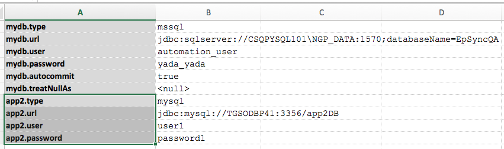

Then in test script, reference the appropriate connection via its name (i.e. `mydb` or `app2`):<br/>
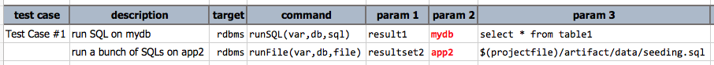

#### Connecting to MongoDB
[MongoDB](https://www.mongodb.com/) is not a relational database. It is another form of database called 
[NoSQL](https://en.wikipedia.org/wiki/NoSQL) that provides a mechanism for managing unstructured (or non-tabular)
data structure. As a convenience, Nexial provides MongoDb connectivity via the `rdbms` commands so that those familar
with the `rdbms` command type might be able to adapt quickly to automating with MongoDb.

Connecting to MongoDb via Nexial is similar to how one would connect to MongoDb directly. One can utilize the same
[MongoDb connection URL](https://docs.mongodb.com/manual/reference/connection-string/). Be sure to specify the 
`<connection name>.type` as `mongodb`, and supply the appropriate credentials via the `<connection name>.user` and 
`<connection name>.password` data variables. For example:<br/>
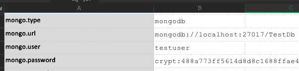


In addition, there's another specialized data variable - `<connection name>.expandDocument` to "expand" the retrieved 
document into columns. This may be of some help as one would be able to directly access the retrieved document via its 
top-level key. For example, by default each document retrieved (such as using 
[db.find()](https://docs.mongodb.com/manual/reference/method/db.collection.find/) command) would be shown as a 
"document" column in separate rows:<br/>
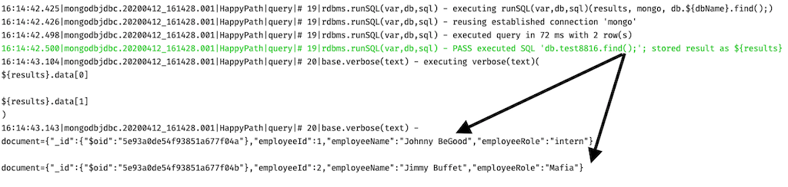

As shown above, each row contains a "document" column, each with the corresponding retrieved JSON document.

When the `.expandDocument` is set to `true`, the retrieved document is "expanded" into individual columns:<br/>
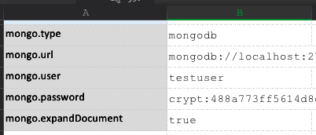<br/>
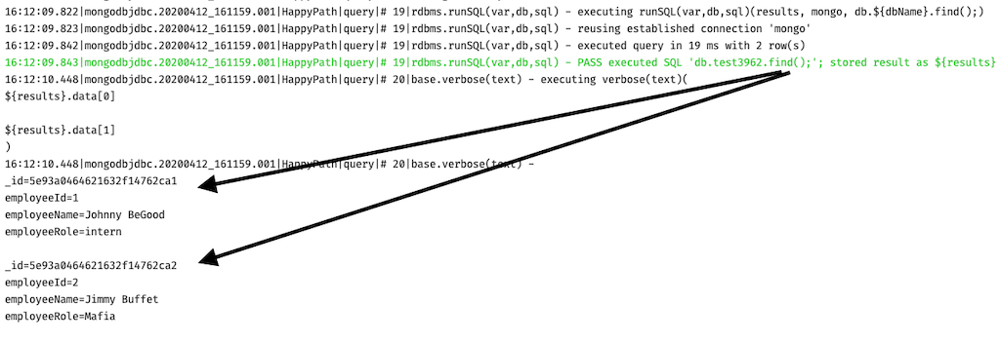<br/>

It is possible to connect to MongoDB via SSL/TLS. However there is a bit of upfront (one-time) work to get it working:

1. Obtain the appropriate `.pem` file for the target MongoDB server.
2. Run the following command with the `keytool` utility that comes with your Java installation (in `$JAVA_HOME/bin`):<br/>
   ```
   keytool -importcert -trustcacerts -file <pem file location> -keystore <trust store location> -storepass <password>
   ```
3. Now reference the generated "trust store" file in your MongoDB connectivity:<br/>
   


### Working with Execution Result
Executing a SQL statement results in a series of outcome. The most common and sought-after is, of course, the 
resultset or dataset - assuming the executed SQL statement is a SELECT statement. However, for UPDATE, DELETE or 
INSERT, one might be more interested in the number of rows affected by the SQL statement in question. Or, perhaps one 
is interested in capturing any errors generated on the database server during SQL execution. For these reasons, Nexial 
is designed to encapsulate the various execution result into a "wrapper", or a "object". This wrapper can be thought 
of as the "outer casing" which houses the various execution results. There are 2 types of wrapper - one for SELECT 
statements and the other one for INSERT/UPDATE/DELETE:<br/>

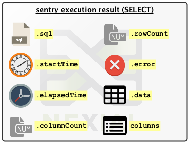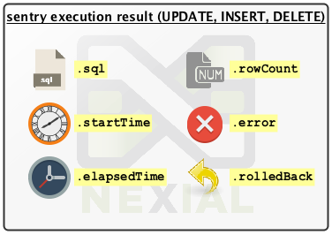

To reference the specific execution result, one would use the dot notation (`.`) like this: `${result}.sql`. This 
would retrieve the SQL statement associated to this execution.  Of course one could assign a different variable name 
other than `result`. 
- `${...}.sql` - retrieves the SQL statement executed to derive this execution result
- `${...}.startTime` - retrieves the time when this SQL was executed, in 
  <a href="https://en.wikipedia.org/wiki/Unix_time" class="external-link" target="_nexial_link">epoch</a> format. 
  Considering using the [`date`](../../functions/$(date)) built-in function to convert the timestamp value into a 
  human-readable form.
- `${...}.elapsedTime` - retrieves the time spent to complete the associated SQL execution, in milliseconds.
- `${...}.rowCount` - retrieves the number of rows affected by the execution of the associated SQL statement. This 
   is usually used when executing a INSERT, DELETE or UPDATE statement. 
- `${...}.error` - retrieves the error message as a result of executing the associated SQL statement. 
- `${...}.data` - retrieves the resultset or dataset; usually only contains data for SELECT statements. To retrieve 
  portion of the dataset,
  - use `${...}.data[1]` notation to retrieve a row of data (row index is zero-based)
  - use `${...}.data[1].column-name` notation to retrieve the value of a specific cell
- `${...}.cells[COLUMN_NAME]`
  - ONLY APPLICABLE TO SELECTs
  - Retrieves data column-wise so that the values of the matching column (as specified via `COLUMN_NAME`) are 
    retrieved, in the order of the rows returned from the query execution, as a list
  - For example, suppose a query returns a data set like this:<br/>
    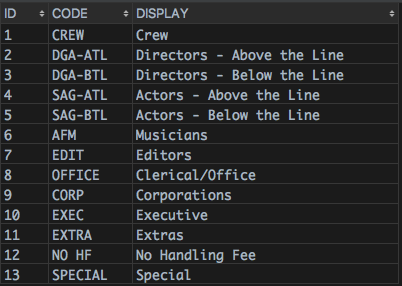  

    If this resultset is encapsulated in a variable named as `${result}`, then <br/>
    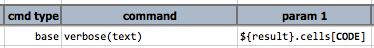
    
    would produce the following:<br/>
    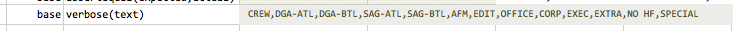
  - Note that some database vendors adhered to case sensitivity for column names
- `${...}.columns` - retrieves the column names of the resultset
- `${...}.columnCount` - retrieves the number of columns in the resultset
- `${...}.rolledBack` - `true` or `false` to indicate whether the execution had resulted in a transaction rollback

Note that many database vendors (and the corresponding database drivers) adhere to case-sensitivity so that column 
'Address' is considered NOT THE SAME as 'address' or 'ADDRESS'.

#### Working with MongoDb Query Result
In addition to the execution result as shown above, MongoDb query result contains additional information:<br/>
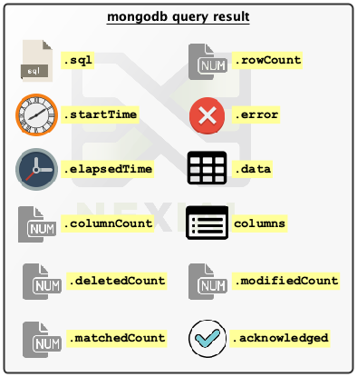

As shown above, there are additional execution results for MongoDb:
- `${...}.deletedCount` - retrieves the number of documents deleted; applicable only when using MongoDb's 
   [delete commands](https://docs.mongodb.com/manual/reference/method/db.collection.find/).
- `${...}.modifiedCount` - retrieves the number of documents modified; applicable only when using MongoDb's 
   [update commands](https://docs.mongodb.com/manual/reference/command/update/). 
- `${...}.matchedCount` - retrieves the number of documents matched to the 
   [update commands](https://docs.mongodb.com/manual/reference/command/update/) command.
- `${...}.acknowledged` - `true`/`false` to signify whether a write operation was acknowledged by the corresponding 
   MongoDb server. It is often safe to ignore this except for high volume writes to replica set. For more information, 
   check out MongoDb's document on [Write Concern](https://docs.mongodb.com/manual/reference/write-concern/).


### Available Commands
- [`resultToCSV(var,csvFile,delim,showHeader)`](resultToCSV(var,csvFile,delim,showHeader))
- [`runFile(var,db,file)`](runFile(var,db,file))
- [`runSQL(var,db,sql)`](runSQL(var,db,sql))
- [`runSQLs(var,db,sqls)`](runSQLs(var,db,sqls))
- [`saveResult(db,sql,output)`](saveResult(db,sql,output))
- [`saveResults(db,sqls,outputDir)`](saveResults(db,sqls,outputDir))
