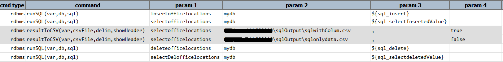
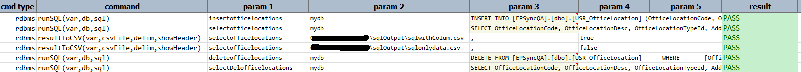

### Description
- This command is to store the result of the sql statement into .csv file.
- This is useful when there is returned sql results stored in variable.
- Those variable can be copied into external .csv file for further verification.

### Parameters
- **var** - this parameter is the stored sql results into variable.
- **csvFile** - this parameter is the full path along with file name of the csv file where the results to be stored
- **delim** - this parameter is the delimiter to be used to separate the values while copying to the csv file.
- **showHeader** - this parameter is either true or false value.if the value set to true then the column name of 
  the table will be copied to the csv file or else only the data.  This can be useful where in situation you only 
  need data and no table columns.

### Example
**Script**: 

**Output**: 

### See Also
- [`runSQL(var,db,sql)`](runSQL(var,db,sql))
