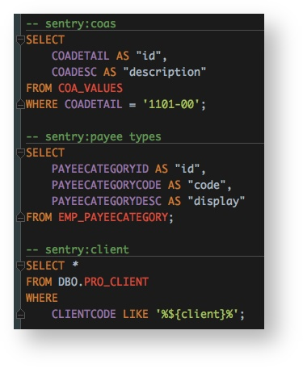
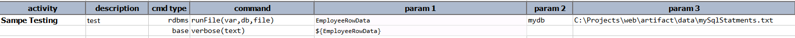
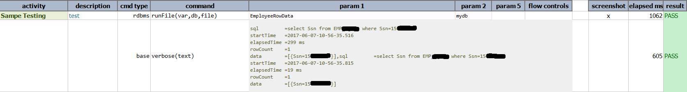

### Description
This command executes a series of SQL statements. The difference between this command and 
[`runSQLs(var,db,sqls)`](runSQLs(var,db,sqls)) is that this command uses an external file for all the SQL 
statements to execute, while [`runSQLs(var,db,sqls)`](runSQLs(var,db,sqls)) expects all the SQL statements to be 
specified as a parameter. Other than that, both commands have the same capabilities, namely:

1. **Execute one or more SQL statements**, which can be a mixed of INSERT, DELETE, UPDATE, SELECT and EXEC stored 
   procedures.
2. **Token substitution within the SQLs are carried out prior to execution**. For example, the last SQL statement 
   below has a variable specified - `${client}`. This variable will be replaced by its associated value prior to 
   execution.   
   
3. **Separate variable binding per SQL statement.** One can indicate a variable name (as part of comment) for each 
   SQL statement, which will instruct Nexial to assign the associated execution result to such variable. Using the 
   example above,
   1. The result of the first SQL will be assigned to the variable `${coas}`.
   2. The result of the second SQL will be assigned to the variable `${payee types}`.
   3. The result of the third SQL will be assigned to the variable `${client}`.  The variable will contain the same 
      properties as per [`runSQL(var,db,sql)`](runSQL(var,db,sql)). See 
      [`Working with Execution Result`](index) for more details.
4. These SQL statements can potentially be committed or rolled back as a single transaction (one unit of work). To 
   enforce single transaction, [`<connection name>.autocommit`](index)` must be set to `false`.

### Parameters
- **var** - this parameter is to store result of the sql query into variable.
- **db** - this parameter is name of the database defined in data file.
- **file** - this parameter is the location and the file name where are all sql statement are kept. 
  Consider using [`syspath`](../../functions/$(syspath)) in order to keep all test artifacts in same or similar 
  directory structure.

### Example
**Script**: 

**Output**: 

### See Also
- [`runSQL(var,db,sql)`](runSQL(var,db,sql))
