### Description
- This command is to run the sql statement against the database. In other words using this command the sql statement 
  can be execute and retrieved data can be used for verification.
- The command will connect to the database and execute sql statement as per connection strings and credential provided.
- If command is successful the result will pass or will fail otherwise.
- Output of the result stored in variable can be read with the attribute as:
  - **`rowCount`** - the number of selected or affected rows.
  - **`sql`** - the SQL query used when executing this command.
  - **`startTime`** - the time in [`epoch`](../../functions/$(date)) when this command was executed.
  - **`elapsedTime`** - the amount of elapsed millisecond to complete the execution of this command.
  - **`columns`** - the column(s) of the selected resultset. 
  - **`data`** - the selected resultset due to the execution of the specified SQL.

### Parameters
- **var** - this parameter is to store result of the sql query as a variable.
- **db** - this parameter is name of the database defined in data file.
- **sql** - this parameter is the sql statement like select, insert update or delete statement.

### Example
**Script**: 
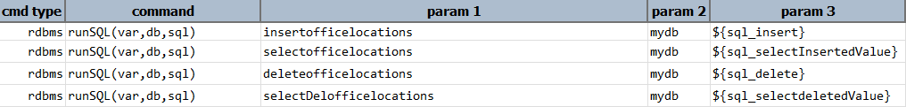  

**Output**: 
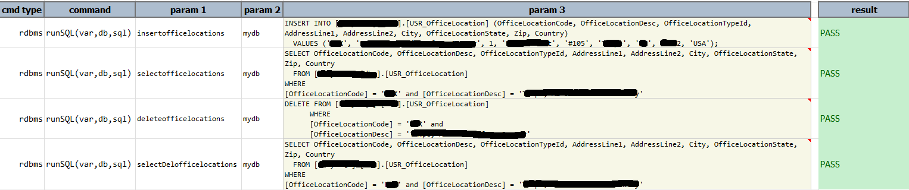

**Below are the example to extract attributes from variables returned by the command.**
- **rowCount**: this attribute will provide the total row count of the from the sql query executed.  
  Script:   
  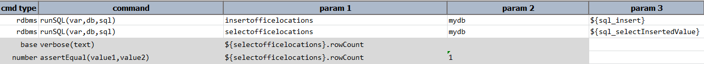  

  Output:   
  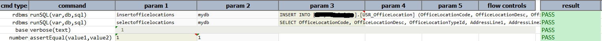  

- **sql**: this attribute of the result set will provide the actual sql statement executed.  
  Script:   
  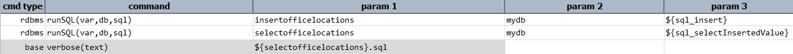  

  Output:   
  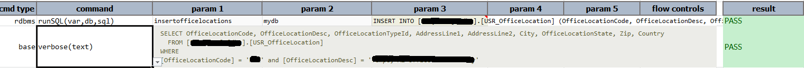  

- **startTime** - this attribute of the result set will provide startTime of the sql query executed  
  Script:   
  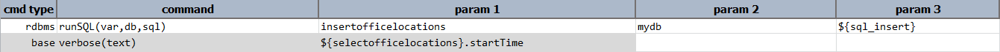  

  Output:   
  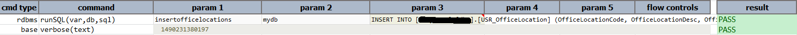

- **elapsedTime:** this attribute of the result set will provide elapsedTime of the sql query.in other words time 
  taken to execute the query.  
  Script:   
  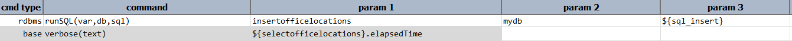  

  Output:   
  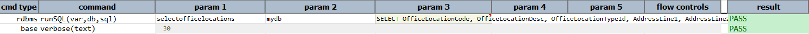  

- **columns**: this attribute will provide the column names of the sql query executed.  
  Script:   
  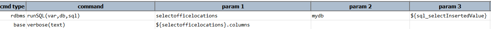  

  Output:   
  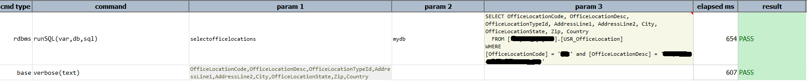  

- **data**: this attribute contains the result due to execution of the specified SQL query. One may use it in the 
  form of `.data[row].column_name` such as:
  - `${result}.data[0].columnA` - reference the data in column `columnA` of the first row (zero-based).
  - `${result}.data[3].officeLocation` - reference the data in column `officeLocation` in the 4th row (zero-based).

  Script: 
  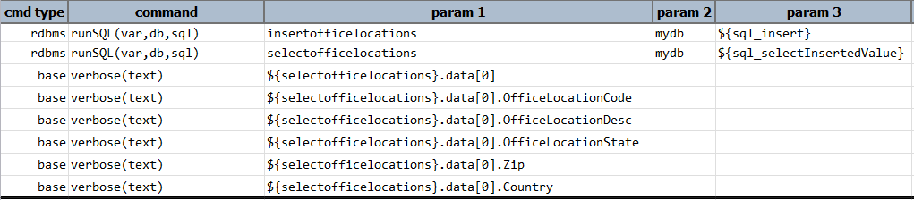  

  Output: 
  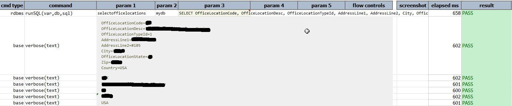

### See Also
- [`runSQLs(var,db,sqls)`](runSQLs(var,db,sqls))
