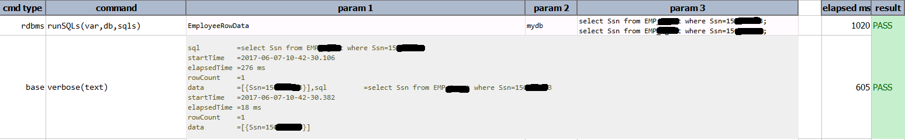

### Description
- This command is to run the multiple sql statements against database.. In other words using this command the 
  multiple sql statements can be execute and retrieved data can be used for verification.
- The command will connect to the database and execute sql statements as per connection strings and credential provided.
- If command is successful the result will pass or will fail otherwise.
- Output of the result stored in variable can be read with attributes `.rowCount`, `.sql`, `.startTime`, 
  `.elapsedTime`, `.columns`, `.data` for each query.  

### Parameters
- **var** - this parameter is to store result of the sql query into variable.
- **db** - this parameter is name of the database defined in data file.
- **sqls** - this parameter is the multiple sql statement like select, insert update or delete statement.

### Example
**Script**: 

**Output**: 

### See Also
- [`runSQL(var,db,sql)`](runSQL(var,db,sql))
- [`runFile(var,db,file)`](runFile(var,db,file))