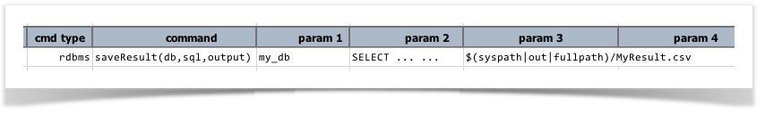
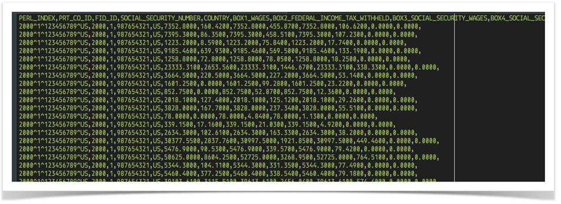
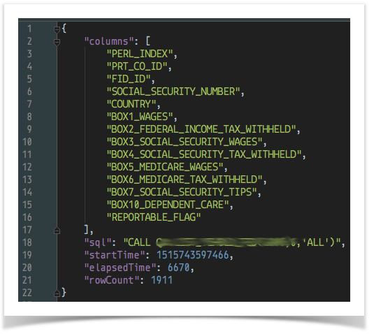
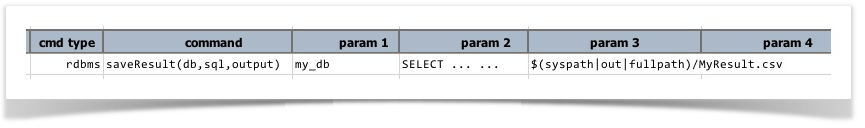

### Description
This command is similar to [`runSQL(var,db,sql)`](runSQL(var,db,sql)), except that the query result is saved to 
`output`. The output will be in CSV format (comma to delimit fields, and `\n` to delimit record). This can be 
extremely useful for file comparison or post-query processing dealing with CSV. In addition to saving query output 
to file, the metadata of the executed query is also saved to a JSON file corresponding to the specified `output`. 
For example, 

Assuming that the query runs successfully, a **`MyResult.csv`** will be created in the `out` directory (as specified), 
and a **`MyResult.json`** (query metadata) will be created in the same directory.

Below is a snapshot of the `output` CSV file generated via this command (comma-separated fields, newline-separated 
records): 

#### Query Metadata
The content of the query metadata differs by the query specified. In general, it contains the 
[`Execution Result`](index) but without the dataset. For example, the screenshot shows one such JSON containing:

1. column names
2. the sql that was executed
3. the start time of such execution, in epoch
4. the elapsed time, in millisecond, to complete the execution
5. the number of rows returned via such execution

### Parameters
- **db** - the profile from which defines the [`database connectivity details`](index).
- **sql** - the query to execute. Note that if this query does not result in any dataset (such as a UPDATE or 
  INSERT query), then only the result metadata file (JSON) will be generated.
- **output** - the target file to save the resulting dataset.

### Example

### See Also
- [`runSQL(var,db,sql)`](runSQL(var,db,sql))
- [`runSQLs(var,db,sqls)`](runSQLs(var,db,sqls))
- [`saveResults(db,sqls,outputDir)`](saveResults(db,sqls,outputDir))
