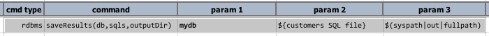
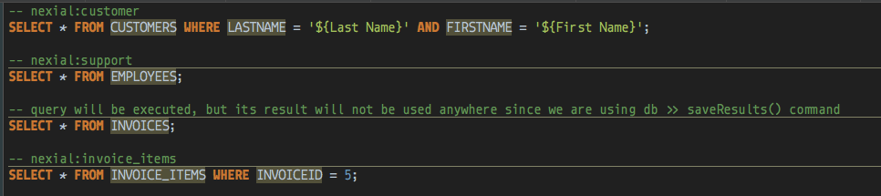
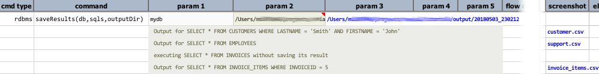

### Description
This command is similar to [`saveResult(var,db,output)`](saveResult(db,sql,output)), except that this command works 
on a series of queries.  The second parameter, `sqls`, can be either a data variable or a file to represent a series 
of queries.  The third parameter would indicate the location from which the results should be saved.  Similar to 
[`saveResult(var,db,output)`](saveResult(db,sql,output)), this command will save both the query result (as CSV) and 
the query metadata (as JSON).

In order to associate the query result to a output file of your choosing, this command will utilize the associated 
"nexial variable" as the output file name.  For example,

```sql
-- nexial:table1_output
SELECT * FROM table1;

-- nexial:table2_output
SELECT * FROM table2;

SELECT * FROM table3;
```

Nexial will then save the result of the first query as `table1_output.csv` and its resulting metadata as 
`table1_output.json`, and the result of the second query as `table2_output.csv` and its resulting metdata as 
`table2_output.json`.  However, since no variable was assigned for the third query, no output files will be 
generated for it (although it will still be executed). Be sure to select the appropriate variable name for each 
query - unique and suitable as a file name.

The output CSV will use comma to field delimiter and newline `\n` as record delimiter.

The `outputDir` parameter must be a valid and writable directory.

Please see [Query Metadata](saveResult(db,sql,output)#query-metadata) for more details about the metadata content 
saved as a JSON file.


### Parameters
- **db** - the profile from which defines the [`database connectivity details`](index).
- **sqls** - the queries to execute.  This can be a data variable or a fully-qualified file path containing the 
  queries to execute.
- **outputDir** - the target location to save the output files.


### Example
**Script**:<br/>


`${cutomers SQL file}` is a file with the following content:<br/>


Note that the third query **DOES NOT** have variable assignment.


**Output**:<br/>


Note that the only 3 ouputs are produced since the third query does not have any variable assigned.  Since the third
parameter (`outputDir`) is specified as the output directory, one would find 6 files there: 3 CSV and 3 JSON.


### See Also
- [`runSQL(var,db,sql)`](runSQL(var,db,sql))
- [`runSQLs(var,db,sqls)`](runSQLs(var,db,sqls))
- [`saveResult(db,sql,output)`](saveResult(db,sql,output))
