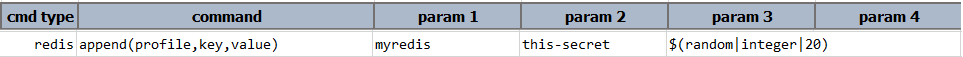

### Description
This command is used to append the value of the `key` with the given `value`. 

### Parameters
-  **profile** - the profile which defines the `redis` connection details. (Refer [here](index.html#defining-profile) to know how to define `profile`)
-  **key** - this parameter is `redis` database key.
-  **value** - this parameter is the value that is to be appended with the value of the given `key`.

### Example
**Script**: 

**Output**: 

### See Also