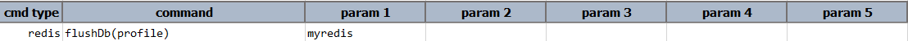
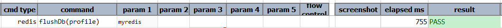

### Description
This command is used to remove all keys from the current database. 

### Parameters
- **profile** - is the profile name with which `redis` database details are defined.

### Example
**Script**: 

**Output**: 

### See Also
- [`flushAll(profile)`](flushAll(profile))
