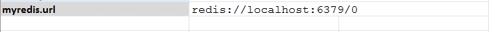

### Introduction to Redis

Redis is an open source (BSD licensed), in-memory data structure store, used as a database, cache and message broker. 
It supports data structures such as strings, hashes, lists, sets, sorted sets with range queries, bitmaps, 
hyperloglogs and geospatial indexes with radius queries. Redis has built-in replication, Lua scripting, LRU eviction, 
transactions and different levels of on-disk persistence, and provides high availability via Redis Sentinel and 
automatic partitioning with Redis Cluster.

Learn more about redis:
- <a href="https://redis.io/topics/introduction" class="external-link" target="_nexial_link">https://redis.io/topics/introduction</a>

#### Defining profile
Nexial simplifies the connectivity to a Redis server via the concept of a `profile`, much like the case for 
[`rdbms`](../rdbms), [`ssh`](../ssh) and [`aws.s3 ](../aws.s3).  In this case, the profile would contain the connection
URL to the target Redis server.  For example, 
 

Here, `myredis` would be considered the profile name, and be used as the `profile` argument in commands below.

For more details about Redis connectivity, check out the following links:
- <a href="https://github.com/lettuce-io/lettuce-core/wiki/Redis-URI-and-connection-details" class="external-link" target="_nexial_link">https://github.com/lettuce-io/lettuce-core/wiki/Redis-URI-and-connection-details</a>
- <a href="https://www.iana.org/assignments/uri-schemes/prov/redis" class="external-link" target="_nexial_link">https://www.iana.org/assignments/uri-schemes/prov/redis</a>

Note: Future version of Nexial might include additional Redis connectivity details.
  

### Available Commands
- [`append(profile,key,value)`](append(profile,key,value))
- [`assertKeyExists(profile,key)`](assertKeyExists(profile,key))
- [`delete(profile,key)`](delete(profile,key))
- [`flushAll(profile)`](flushAll(profile))
- [`flushDb(profile)`](flushDb(profile))
- [`rename(profile,current,new)`](rename(profile,current,new))
- [`set(profile,key,value)`](set(profile,key,value))
- [`store(var,profile,key)`](store(var,profile,key))
- [`storeKeys(var,profile,keyPattern)`](storeKeys(var,profile,keyPattern))
