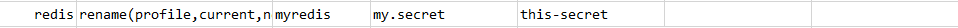

### Description
This command is used to rename a key in the database.

### Parameters
- **profile** - is the profile name with which `redis` database details are defined. (Refer [here](index.html#defining-profile) to know how to define `profile`)
- **current** - is the current key name required to be renamed.
- **new** - is the new name to be given to the specified key.

### Example
**Script**: 

**Output**: 

### See Also