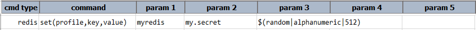
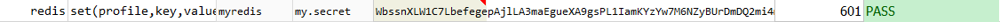

### Description
This command is used to set the `value` as the value of the `key`.

### Parameters
- **profile** - is the profile name with which `redis` database details are defined. (Refer [here](index.html#defining-profile) to know how to define `profile`)
- **key** - is the key for which the `value` to be set.
- **value** - is the value to be set to the specified `key`. 

### Example
**Script**: 

Output:

### See Also
- [`store(var,profile,key)`](store(var,profile,key))
- [`storeKeys(var,profile,keyPattern)`](storeKeys(var,profile,keyPattern))