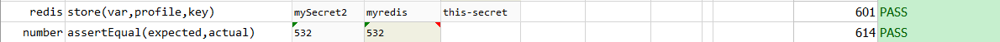

### Description
This command is used to retrieve the value of the `key` specified from the database and store the value to the given `var`.

### Parameters
- **var** - is the variable name where the retrieved value to be stored. 
- **profile** - is the profile name with which `redis` database details are defined. (Refer [here](index.html#defining-profile) to know how to define `profile`)
- **key** - is the database key from which the value to be retrieved.

### Example
**Script**: 

**Output**: 

### See Also
- [`storeKeys(var,profile,keyPattern)`](storeKeys(var,profile,keyPattern))